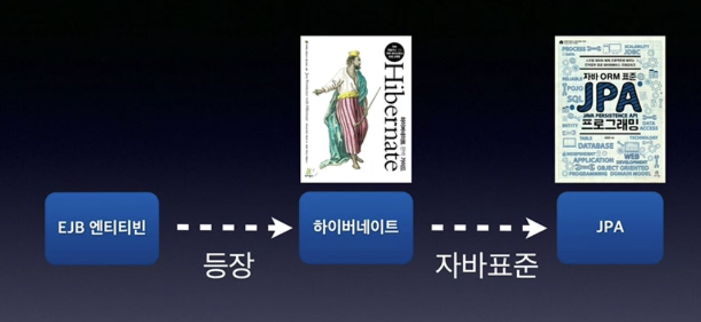

# 객체 지향 설계와 스프링

## 이야기 - 자바 진영의 추운 겨울과 스프링의 탄생

1. EJB라고 자바 진영의 정파 기술이 있었음
    - entity bean : ORM 자바 객체를 가져오는 기술 중 하나
    - 분산, 선언적 트랜잭션 가능
    - 비용이 비쌈
2. EJB 지옥에 갇힘
    - 와중에 entity bean은 기술적으로 너무 약함
    - Hibernate를 만든 갤빈 킹, Spring framework를 만든 로드 존슨
3. 순수하게 자바 진영으로 돌아가자 → POJO
4. 스프링과 하이버네이트  
   4-1. 스프링 : EJB 컨테이너를 대체하며 단순함의 승리. 현재 사실상 표준 기술  
   4-2. 하이버네이트 : EJB 엔티티빈 기술을 대체. JPA 새로운 표준 정의
   
   
    

### 스프링 역사

- 전통적인 J2EE(EJB)라는 겨울을 넘어 새로운 시작이라는 뜻으로 지음
- EJB 없이도 충분히 고품질의 확장 가능한 애플리케이션을 개발할 수 있음을 보여주고 30,000라인 이상의 기반 기술을 예제 코드로 선보임  
=> 지금의 스프링 핵심 개념과 기반 코드가 들어가 있음

> 💡**스프링 핵심 개념**  
> BeanFactory, ApplicationContext, POJO,
> 제어의 역전, 의존관계 주입

### 릴리즈
- 2003년 스프링 프레임워크 1.0 출시 - XML
- 2006년 스프링 프레임워크 2.0 출시 - XML 편의 기능 지원
- 2009년 스프링 프레임워크 3.0 출시 - 자바 코드로 설정
- 2013년 스프링 프레임워크 4.0 출시 - 자바8
- 2014년 스프링 부트 1.0 출시
- 2017년 스프링 프레임워크 5.0, 스프링 부트 2.0 출시 - 리액티브 프로그래밍 지원
- 2020년 9월 스프링 프레임워크 5.2x, 스프링 부트 2.3x 

- 설정과 배포가 너무 힘들다!!
- 서버도 내장하고 설정을 편하게 하는 게 유행하는 중이었다.

## 스프링이란?

- 여러 가지 기술의 모음


### 스프링 프레임워크 vs 스프링부트


- 스프링은 단독으로 사용하는 것이 아님 여러 시스템의 모음
- 스프링부트 : 스프링을 편리하게 사용할 수 있도록 스프링 애플리케이션을 쉽게 생성
    - Tomcat같은 별도의 웹서버를 설치하지 않아도 됨
    - 손쉬운 빌드 구성을 위한 starter 종속성 제공
        - 라이브러리 하나 땡기면 필요한 다른 라이브러리까지 다 땡겨줌
    - 스프링과 3rd party 라이브러리 자동 구성
        - 버전같은고...

### 스프링이라는 단어?

- 스프링 DI 컨테이너 기술
- 스프링 프레임워크
- 스프링 부트, 프레임워크를 모두 포함한 생태계 자체

### 스프링의 진짜 핵심

- 스프링은 자바 언어 기반의 프레임워크
- 자바 언어의 가장 큰 특징 -> 객체 지향 언어
- 스프링은 객체 지향 언어가 가진 강력한 특징을 살려내는 프레임워크
- 스프링은 좋은 객체 지향 애플리케이션을 개발할 수 있게 도와주는 프레임워크

## 좋은 객체 지향 프로그래밍이란?

객체 지향의 특징에는 아래 4가지가 있음

- 추상화
- 캡슐화
- 상속
- 다형성

⇒ **유연하고 변경이 용이하다**   
⇒ 핵심은 다형성

## 다형성

역할과 구현으로 구분 가능함

- 운전자 - 자동차
    - 자동차 : 인터페이스, 운전자 : 클라이언트
    - 자동차가 바뀌어도 운전자에게 영향을 주지 않음
    - 자동차 역할만 구현하면 되기 때문에 자동차 세상을 무한정으로 확장할 수 있다.
    - 클라이언트에 영향을 주지 않고 새로운 기능 추가 가능 (역할 vs 구현)

  

- 로미오와 줄리엣 공연 무대
    - 로미오 : 클라이언트, 줄리엣 : 서버
    - 배우는 대체 가능해야함 → 대체 가능성 → **유연하고 변경에 용이함**

  


>💡 **자바 언어의 다형성 활용**
>- 객체를 설계할 때 역할과 구현을 명확히 분리
>- 객체 설계 시 역할(인터페이스)를 먼저 부여하고, 그 역할을 수행하는 구현 객체 만들기
>- **구현보다 인터페이스가 먼저**
>
>- 역할 = 인터페이스
>- 구현 = 인터페이스를 구현한 클래스, 구현 객체


다형성을 구현하려면 객체의 협력이라는 관계부터 생각해야한다.

- 혼자 있는 객체는 없음
- 클라이언트 : 요청, 서버 : 응답
- 수 많은 객체 클라이언트와 객체 서버는 서로 협력 관계를 가진다


## 자바 언어의 다형성

- 오버라이딩으로 자바의 다형성이 구현되고 오버라이딩 된 메서드가 실행됨
    - 의존한다 : 내가 쟤를 알고있다
- 실행 시점에 유연하게 인터페이스를 구현한 객체를 변경 가능
- 다형성의 본질을 이해하려면 협력이라는 객체 사이의 관계에서 시작해야함
- **클라이언트를 변경하지 않고, 서버의 구현 기능을 유연하게 변경할 수 있다.**


```java
public class MemberService {
	//private MemberRepository memberRepository = new MemoryMemberRepository();
	private MemberRepository memberRepository = new JdbcMemberRepository();
}
```

- 다형성을 통해 역할과 구현이 분리되었기 때문에 객체 세상으로 가져올 수 있음
- 유연하며 변경이 용이하여 **확장 가능한 설계**를 할 수 있다.
- 인터페이스를 안정적으로 잘 설계하는 것이 중요
- 스프링은 객체 지향을 잘 할 수 있도록 도와줌

## 좋은 객체 지향 설계의 5가지 원칙(SOLID)

로버트 마틴이 정리한 객체 지향 설계의 5가지 원칙

- SRP: 단일 책임 원칙(single responsibility principle)
- OCP: 개방-폐쇄 원칙 (Open/closed principle)
- LSP: 리스코프 치환 원칙 (Liskov substitution principle)
- ISP: 인터페이스 분리 원칙 (Interface segregation principle)
- DIP: 의존관계 역전 원칙 (Dependency inversion principle)

### SRP 단일 책임 원칙

- 한 클래스는 하나의 책임만 가져야 한다
- 중요한 기준은 변경이며 변경이 있을 때 파급 효과가 적으면 단일 책임 원칙을 잘 따른 것
    - ex) UI 변경, 객체의 생성과 사용을 분리

### OCP 개방-폐쇄 원칙

- 소프트웨어 요소는 확장에는 열려 있으나 변경에는 닫혀 있어야 한다
    - 인터페이스를 구현한 새로운 클래스를 하나 만들어서 새로운 기능 구현
    - 다형성을 활용 (역할과 구현의 분리)

```java
public class MemberService {
	//private MemberRepository memberRepository = new MemoryMemberRepository();
	private MemberRepository memberRepository = new JdbcMemberRepository();
}
```

- 문제점
    - 구현 객체를 변경하려면 클라이언트 코드를 변경해야한다
    - 분명 다형성을 사용했지만 OCP 원칙을 지킬 수 없다

  **⇒ 객체를 생성하고, 연관관계를 맺어주는 별도의 조립, 설정자가 필요하다.**


### LSP 리스코프 치환 원칙

- 프로그램의 객체는 프로그램의 정확성을 깨뜨리지 않으면서 하위 타입의 인스턴스를 바꿀 수 있어야 한다
    - 기능적으로 보장이 필요
    - ex) 자동차 인터페이스의 엑셀은 앞으로 가는 기능인데 뒤로 가게 구현하면 LSP 위반
- 단순히 컴파일에 성공한다고 되는게 아니다
- 다형성에서 하위 클래스는 인터페이스 규약을 다 지켜야 한다는 것, 다형성을 지원하기 위한 원칙, 인터페이스를 구현한 구현체는 믿고 사용하려면, 이 원칙이 필요하다

### ISP 인터페이스 분리 원칙

- 특정 클라이언트를 위한 인터페이스 어려 개가 범용 인터페이스 하나보댜 낫다
    - 자동차 인터페이스 → 운전 인터페이스, 정비 인터페이스로 분리
    - 사용자 클라이언트 → 운전자 클라이언트, 정비사 클라이언트로 분리
    - 서로의 영역에 영향을 주지 않음
- 인터페이스가 명확해지고 대체 가능성이 높아진다.

### DIP 의존관계 역전 원칙

- 프로그래머는 “추상화"에 의존해야지 “구체화"에 의존하면 안된다.
    - 클라이언트가 구현을 바라보지 말고 인터페이스를 바라봐야 함
- 역할(Role)에 의존하게 해야 한다.
    - ex) 자동차 인터페이스에 집중해야지 K3를 안다고 되는게 아니다.
- 객체 세상도 클라이언트가 인터페이스에 의존해야 유연하게 구현체를 변경할 수 있다. 구현체에 의존하게 되면 변경이 아주 어려워진다.

```java
public class MemberService {
	//private MemberRepository memberRepository = new MemoryMemberRepository();
	private MemberRepository memberRepository = new JdbcMemberRepository();
}
```

- OCP에서 설명한 MemberService는 인터페이스에도 의존하지만 구현 클래스도 동시에 의존한다
    - MemberService는 MemoryMemberRepository에 의존한다! (의존 = 내가 저 코드를 안다)
- MemberService 클라이언트가 구현 클래스를 직접 선택 **⇒ DIP 위반**
    - Repository 인터페이스에만 의존하도록 설계해야함

### 객체지향과 다형성

- 객체 지향의 핵심은 다형성
- 다형성 만으로는 쉽게 부품 갈아 끼우듯이 개발할 수 없다. 구현 객체를 변경할 때 클라이언트 코드도 함께 변경된다.
- 다형성 만으로는 OCP, DIP를 지킬 수 없다
- 뭔가 더 필요하다....

## 객체 지향 설계와 스프링

- 원칙을 지키면서 개발을 하다보면 프레임워크가 필요한 단계가 온다
- 스프링은 다형성 + OCP + DIP를 가능하게 지원
    - DI(Dependency Injection) : 의존관계 , 의존성 주입
    - DI 컨테이너 제공 : 안에서 의존관계를 연결하고 주입

## 정리

- 모든 설계에 역할과 구현을 분리하자
- 인터페이스를 먼저 설계하고 구현을 하자
- 인터페이스를 도입하면 추상화라는 비용이 발생한다
    - 클래스 여러 개 만드는 비용
    - 개발자가 코드를 한 번 더 까봐야함 (런타임에 구현체가 결정될 수 있음)
- 기능을 확장할 가능성이 없다면, 구체 클래스를 직접 사용하고, 향후 꼭 필요할 때 리팩터링해서 인터페이스를 도입하는 것도 방법이다.