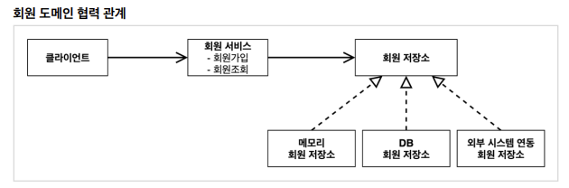

# 스프링 핵심 원리 이해1 - 예제 만들기

---

- 인터페이스와 객체를 나눠서 순수한 java로 개발 (스프링의 도움 없이) - 얼마나 거지같은지 봐보라는 건가
- 비즈니스 예제를 듣고 애플리케이션 생성

## 프로젝트 생성

[Spring Initializr](https://start.spring.io/)

- 할인 정책 등 요구사항이 일부 변경 될 여지가 있거나 아직 확정되지 않았음

## 회원 도메인 설계




## 회원 도메인 설계의 문제점

- 다른 저장소로 변경할 때 OCP 원칙(개방-폐쇄의 원칙)을 잘 준수할까요?
- DIP를 잘 지키고 있을까요?
    - 의존관계가 인터페이스 뿐만 아니라 구현까지 모두 의존하는 문제점이 있음
    - 주문까지 만들고나서 문제점과 해결 방안을 설명

```java
public class MemberServiceImpl implements MemberService{

    private final MemberRepository memberRepository = new MemoryMemberRepository();

    @Override
    public void join(Member member) {
        memberRepository.save(member);
    }

    @Override
    public Member findMember(Long memberId) {
        return memberRepository.findById(memberId);
    }
}
```

- `MemberServiceImpl`는 `MemberRepository`도 의존하고 `MemoryMemberRepository`도 의존함

→ 추상화와 구체화에 전부 의존함

## 주문 도메인 설계


- 역할들의 협력 관계를 그대로 재사용 할 수 있다

```java
public class OrderServiceImpl implements OrderService{

    private final MemberRepository memberRepository = new MemoryMemberRepository();
    private final DiscountPolicy discountPolicy = new FixDiscountPolicy();

    @Override
    public Order createOrder(Long memberId, String itemName, int itemPrice) {
        Member member = memberRepository.findById(memberId);
        int discountPrice = discountPolicy.discount(member, itemPrice); // DI원칙을 잘 지키는 설계

        return new Order(memberId, itemName, itemPrice, discountPrice);
    }
}
```

- `OrderService` 입장에서는 할인에 대한 건 `discountPolicy`에 위임하고 할인 금액만 알려줘!
- 나중에 할인이 변경되면 주문쪽은 변경하지 않고 할인쪽만 변경하면 됨

⇒ 단일 책임 원칙을 잘 지킨 것

과연 정률 할인 정책으로 깔끔하게 바꿀 수 있는가?