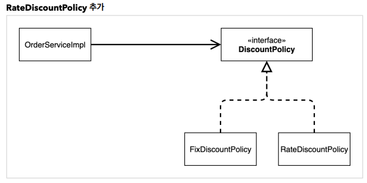

# 스프링 핵심 원리 이해2 - 객체 지향 원리 적용

---

- 기존 코드에 객체지향의 원리 적용

## 새로운 할인 정책 개발



```java
public class OrderServiceImpl implements OrderService {

  // private final DiscountPolicy discountPolicy = new FixDiscountPolicy();
   private final DiscountPolicy discountPolicy = new RateDiscountPolicy();

	...
}
```

- 역할과 구현, 다형성, 구현 객체 분리 모두 지켰음
- 객체지향 설계 원칙은? 지킨 것처럼 보이지만 아니다.

  

- 클래스 의존관계를 보면 구체적인 구현 클래스에도 의존중 ⇒ **DIP 위반**
    - 추상(인터페이스) 의존: `DiscountPolicy`
    - 구체(구현) 클래스: `FixDiscountPolicy` , `RateDiscountPolicy`
- `FixDiscountPolicy` 를 `RateDiscountPolicy`로 변경하는 순간 `OrderServiceImpl`의 소스 코드도 함께 변경해야 한다 ⇒ **OCP 위반**

>💡 인터페이스에만 의존하도록 설계를 변경하자


```java
public class OrderServiceImpl implements OrderService{

    private final MemberRepository memberRepository = new MemoryMemberRepository();
		// 여기를 수정함    
		// new로 지정하는 부분을 없애야 인터페이스에만 의존하는 설계이다
		private DiscountPolicy discountPolicy; 
		
		...
}
```


# 관심사 분리

- 배우는 본인의 역할인 배역을 수행하는 것에만 집중해야 한다.
- 디카프리오는 어떤 여자 주인공이 선택되더라도 똑같이 공연을 할 수 있어야 한다.
- 공연을 구성하고, 담당 배우를 섭외하고, 역할에 맞는 배우를 지정하는 책임을 담당하는 별도의 공연
  기획자가 나올시점이다.
- 공연 기획자를 만들고, 배우와 공연 기획자의 책임을 확실히 분리하자
- `AppConfig` : 구현 객체를 생성하고 연결하는 역할


- 의존관계 주입 / 의존성 주입
- 실행에만 신경쓰면 되고, 인터페이스에만 의존한다. 인터페이스의 구현체는 `appconfig`가 매칭해준다.
- **orderApp → AppConfig → MemberService → MemberServiceImpl**

    ```java
    public class OrderApp {
        public static void main(String[] args) {
    
            AppConfig appConfig = new AppConfig();
            MemberService memberService = appConfig.memberService();
            OrderService orderService = appConfig.orderService();
    
            Long memberId = 1L;
            Member member = new Member(memberId, "memberA", Grade.VIP);
            memberService.join(member);
    
            Order order = orderService.createOrder(memberId, "itemA", 10000);
    
            System.out.println("order = " + order);
        }
    }
    ```

    ```java
    public class AppConfig {
    
        public MemberService memberService() {
            return new MemberServiceImpl(new MemoryMemberRepository());
        }
    
        public OrderService orderService(){
            return new OrderServiceImpl(new MemoryMemberRepository(), new FixDiscountPolicy());
        }
    }
    ```

    ```java
    public class MemberServiceImpl implements MemberService{
    
        private final MemberRepository memberRepository; // 인터페이스(추상화에서만 의존함)
    
        // 생성자 주입 : 생성자를 통해서 구현체를 선택
        public MemberServiceImpl(MemberRepository memberRepository) {
            this.memberRepository = memberRepository;
        }
    
        @Override
        public void join(Member member) {
            memberRepository.save(member);
        }
    
        @Override
        public Member findMember(Long memberId) {
            return memberRepository.findById(memberId);
        }
    }
    ```


## 좋은 객체 지향 설계의 5가지 원칙의 적용

### SRP 단일 책임 원칙

- 한 클래스는 하나의 책임만 가져야 한다.
- 클라이언트 객체는 직접 구현 객체를 생성하고, 연결하고, 실행하는 다양한 책임을 가지고 있음
- SRP 단일 책임 원칙을 따르면서 관심사를 분리함
- 구현 객체를 생성하고 연결하는 책임은 AppConfig가 담당
- 클라이언트 객체는 실행하는 책임만 담당

### DIP 의존관계 역전 원칙

- 프로그래머는 “추상화에 의존해야지, 구체화에 의존하면 안된다.” 의존성 주입은 이 원칙을 따르는 방법 중
  하나다.
- 새로운 할인 정책을 개발하고, 적용하려고 하니 클라이언트 코드도 함께 변경해야 했다. 왜냐하면 기존
  클라이언트 코드( `OrderServiceImpl` )는 DIP를 지키며 DiscountPolicy 추상화 인터페이스에
  의존하는 것 같았지만, `FixDiscountPolicy` 구체화 구현 클래스에도 함께 의존했다.
- 클라이언트 코드가 `DiscountPolicy` 추상화 인터페이스에만 의존하도록 코드를 변경했다.
  하지만 클라이언트 코드는 인터페이스만으로는 아무것도 실행할 수 없다.
- `AppConfig`가 `FixDiscountPolicy` 객체 인스턴스를 클라이언트 코드 대신 생성해서 클라이언트 코드에 의존관계를 주입했다. 이렇게해서 DIP 원칙을 따르면서 문제도 해결했다.

### OCP 개발-폐쇄 원칙

- 소프트웨어 요소는 확장에는 열려 있으나 변경에는 닫혀 있어야 한다
- 다형성 사용하고 클라이언트가 DIP를 지킴
- 애플리케이션을 사용 영역과 구성 영역으로 나눔
- `AppConfig`가 의존관계를 `FixDiscountPolicy` `RateDiscountPolicy` 로 변경해서 클라이언트 코드에 주입하므로 클라이언트 코드는 변경하지 않아도 됨
- 소프트웨어 요소를 새롭게 확장해도 사용 영역의 변경은 닫혀 있다!
    - 변경에 닫혀 있음 = 변경이 필요 없음

## IoC, DI, 그리고 컨테이너

>💡 **IoC(Inversion of Control)**
>- 제어의 역전
>- 프레임워크 같은 것이 내 코드를 대신 호출해주는 것


- 구현 객체는 자신의 로직을 실행하는 역할만 담당한다. 프로그램의 제어 흐름은 이제 `AppConfig`가 가져간다
- `AppConfig`는 `OrderServiceImpl` 이 아닌 `OrderService` 인터페이스의 다른 구현 객체를 생성하고 실행할 수 도 있다


>💡 **프레임워크 vs 라이브러리**
>- 내가 작성한 코드를 프레임워크가 제어하고 대신 실행 (ex. JUnit)
>- 내가 작성한 코드가 직접 제어의 흐름을 담당한다면 라이브러리


- 정적인 클래스 의존관계
    - 애플리케이션을 실행하지 않아도 분석할 수 있다
    - import 코드만 보고 의존관계를 쉽게 판단 가능
- 동적인 객체 인스턴스 의존 관계
    - 애플리케이션 실행 시점에 실제 생성된 객체 인스턴스의 참조가 연결된 의존 관계다
    - 객체 인스턴스를 생성하고, 그 참조값을 전달해서 연결된다. (자바에서는 참조로 인스턴스들이 연결됨)
    - 의존관계 주입을 사용하면 클라이언트 코드를 변경하지 않고, 클라이언트가 호출하는 대상의 타입
      인스턴스를 변경할 수 있다.
- **의존관계 주입을 사용하면 정적인 클래스 의존관계를 변경하지 않고, 동적인 객체 인스턴스 의존관계를
  쉽게 변경할 수 있다.**

- 정적인 의존관계를 손대지 않는다 = 애플리케이션 코드 변경하지 않는다


>💡 **IoC 컨테이너, DI 컨테이너**
>- AppConfig 처럼 객체를 생성하고 관리하면서 의존관계를 연결해 주는 것을 IoC 컨테이너 또는 DI 컨테이너라 한다.
>- 의존관계 주입에 초점을 맞추어 최근에는 주로 DI 컨테이너라 한다. (스프링 외에도 다양한 오픈소스가 있음)
>- 또는 어샘블러, 오브젝트 팩토리 등으로 불리기도 한다.


## 스프링으로 전환하기

```java
package hello.core;

import hello.core.discount.DiscountPolicy;
import hello.core.discount.FixDiscountPolicy;
import hello.core.discount.RateDiscountPolicy;
import hello.core.member.MemberRepository;
import hello.core.member.MemberService;
import hello.core.member.MemberServiceImpl;
import hello.core.member.MemoryMemberRepository;
import hello.core.order.OrderService;
import hello.core.order.OrderServiceImpl;
import org.springframework.context.annotation.Bean;
import org.springframework.context.annotation.Configuration;

@Configuration
public class AppConfig {

    @Bean
    public MemberService memberService() {
        return new MemberServiceImpl(memberRepository());
    }

    @Bean
    public MemberRepository memberRepository() {
        return new MemoryMemberRepository();
    }

    @Bean
    public OrderService orderService(){
        return new OrderServiceImpl(memberRepository(), discountPolicy());
    }

    @Bean
    public DiscountPolicy discountPolicy(){
//        return new FixDiscountPolicy();
        return new RateDiscountPolicy();
    }
}
```

- 스프링 컨테이너는 `@Configuration` 이 붙은 `AppConfig` 를 설정(구성) 정보로 사용
- `@Bean` 이라 적힌 메서드를 모두 호출해서 반환된 객체를 스프링 컨테이너에 등록한다. 이렇게 스프링 컨테이너에 등록된 객체를 **스프링 빈**이라 한다.

```java
// AppConfig appConfig = new AppConfig();
// MemberService memberService = appConfig.memberService();

ApplicationContext applicationContext = new AnnotationConfigApplicationContext(AppConfig.class);
MemberService memberService = applicationContext.getBean("memberService", MemberService.class); //이름, 타입
```

- `main` 메서드에서 `applicationContext`를 받아옴
- 스프링 빈은 `applicationContext.getBean()` 메서드를 사용해서 찾을 수 있다.
- 스프링 빈은 `@Bean` 이 붙은 메서드의 명을 스프링 빈의 이름으로 사용한다. ( memberService ,
  orderService )

스프링 빈으로 등록된 것을 로그에서 볼 수 있음!

```
/Users/seunchoi/Library/Java/JavaVirtualMachines/azul-16.0.2/Contents/Home/bin/java -javaagent:/Applications/IntelliJ IDEA CE.app/Contents/lib/idea_rt.jar=51516:/Applications/IntelliJ IDEA CE.app/Contents/bin -Dfile.encoding=UTF-8 -classpath /Users/seunchoi/Desktop/JPA/core/out/production/classes:/Users/seunchoi/Desktop/JPA/core/out/production/resources:/Users/seunchoi/.gradle/caches/modules-2/files-2.1/org.springframework.boot/spring-boot-starter/2.6.2/c36f1f6886cdbedc5347fdea62b97b44b053b0ba/spring-boot-starter-2.6.2.jar:/Users/seunchoi/.gradle/caches/modules-2/files-2.1/org.springframework.boot/spring-boot-autoconfigure/2.6.2/7c91bce101d3f796cccbc1a6744c1ea389fff73f/spring-boot-autoconfigure-2.6.2.jar:/Users/seunchoi/.gradle/caches/modules-2/files-2.1/org.springframework.boot/spring-boot/2.6.2/bbf59f411320da665411692359ff511315d0ff91/spring-boot-2.6.2.jar:/Users/seunchoi/.gradle/caches/modules-2/files-2.1/org.springframework.boot/spring-boot-starter-logging/2.6.2/58d4896c606b6ff07b9bd8e46c87eac5a51255de/spring-boot-starter-logging-2.6.2.jar:/Users/seunchoi/.gradle/caches/modules-2/files-2.1/jakarta.annotation/jakarta.annotation-api/1.3.5/59eb84ee0d616332ff44aba065f3888cf002cd2d/jakarta.annotation-api-1.3.5.jar:/Users/seunchoi/.gradle/caches/modules-2/files-2.1/org.springframework/spring-core/5.3.14/d87ad19f9d8b9a3f1a143db5a2be34c61751aaa2/spring-core-5.3.14.jar:/Users/seunchoi/.gradle/caches/modules-2/files-2.1/org.yaml/snakeyaml/1.29/6d0cdafb2010f1297e574656551d7145240f6e25/snakeyaml-1.29.jar:/Users/seunchoi/.gradle/caches/modules-2/files-2.1/org.springframework/spring-context/5.3.14/ce6042492f042131f602bdc83fcb412b142bdac5/spring-context-5.3.14.jar:/Users/seunchoi/.gradle/caches/modules-2/files-2.1/ch.qos.logback/logback-classic/1.2.9/7d495522b08a9a66084bf417e70eedf95ef706bc/logback-classic-1.2.9.jar:/Users/seunchoi/.gradle/caches/modules-2/files-2.1/org.apache.logging.log4j/log4j-to-slf4j/2.17.0/e50b82411b9ce9c204c938509f914b2bb887168b/log4j-to-slf4j-2.17.0.jar:/Users/seunchoi/.gradle/caches/modules-2/files-2.1/org.slf4j/jul-to-slf4j/1.7.32/8a055c04ab44e8e8326901cadf89080721348bdb/jul-to-slf4j-1.7.32.jar:/Users/seunchoi/.gradle/caches/modules-2/files-2.1/org.springframework/spring-jcl/5.3.14/ffcf745ed5ba32930771378316fd08e97986bec2/spring-jcl-5.3.14.jar:/Users/seunchoi/.gradle/caches/modules-2/files-2.1/org.springframework/spring-aop/5.3.14/f049146a55991e89c0f04b9624f1f69e1763d80f/spring-aop-5.3.14.jar:/Users/seunchoi/.gradle/caches/modules-2/files-2.1/org.springframework/spring-beans/5.3.14/24cc27af89edc1581a57bb15bc160d2353f40a0e/spring-beans-5.3.14.jar:/Users/seunchoi/.gradle/caches/modules-2/files-2.1/org.springframework/spring-expression/5.3.14/5cd4c568522b7084afac5d2ac6cb945b797b3f16/spring-expression-5.3.14.jar:/Users/seunchoi/.gradle/caches/modules-2/files-2.1/ch.qos.logback/logback-core/1.2.9/cdaca0cf922c5791a8efa0063ec714ca974affe3/logback-core-1.2.9.jar:/Users/seunchoi/.gradle/caches/modules-2/files-2.1/org.slf4j/slf4j-api/1.7.32/cdcff33940d9f2de763bc41ea05a0be5941176c3/slf4j-api-1.7.32.jar:/Users/seunchoi/.gradle/caches/modules-2/files-2.1/org.apache.logging.log4j/log4j-api/2.17.0/bbd791e9c8c9421e45337c4fe0a10851c086e36c/log4j-api-2.17.0.jar hello.core.MemberApp
22:57:18.660 [main] DEBUG org.springframework.context.annotation.AnnotationConfigApplicationContext - Refreshing org.springframework.context.annotation.AnnotationConfigApplicationContext@a74868d
22:57:18.677 [main] DEBUG org.springframework.beans.factory.support.DefaultListableBeanFactory - Creating shared instance of singleton bean 'org.springframework.context.annotation.internalConfigurationAnnotationProcessor'
22:57:18.789 [main] DEBUG org.springframework.beans.factory.support.DefaultListableBeanFactory - Creating shared instance of singleton bean 'org.springframework.context.event.internalEventListenerProcessor'
22:57:18.801 [main] DEBUG org.springframework.beans.factory.support.DefaultListableBeanFactory - Creating shared instance of singleton bean 'org.springframework.context.event.internalEventListenerFactory'
22:57:18.802 [main] DEBUG org.springframework.beans.factory.support.DefaultListableBeanFactory - Creating shared instance of singleton bean 'org.springframework.context.annotation.internalAutowiredAnnotationProcessor'
22:57:18.804 [main] DEBUG org.springframework.beans.factory.support.DefaultListableBeanFactory - Creating shared instance of singleton bean 'org.springframework.context.annotation.internalCommonAnnotationProcessor'
22:57:18.810 [main] DEBUG org.springframework.beans.factory.support.DefaultListableBeanFactory - Creating shared instance of singleton bean 'appConfig'
22:57:18.818 [main] DEBUG org.springframework.beans.factory.support.DefaultListableBeanFactory - Creating shared instance of singleton bean 'memberService'
22:57:18.833 [main] DEBUG org.springframework.beans.factory.support.DefaultListableBeanFactory - Creating shared instance of singleton bean 'memberRepository'
22:57:18.836 [main] DEBUG org.springframework.beans.factory.support.DefaultListableBeanFactory - Creating shared instance of singleton bean 'orderService'
22:57:18.838 [main] DEBUG org.springframework.beans.factory.support.DefaultListableBeanFactory - Creating shared instance of singleton bean 'discountPolicy'
```

### 스프링 컨테이너


>💡 **용어정리**
>- 스프링 컨테이너 : 빈을 관리하는 의미에서의 애플리케이션 컨텍스트 **(애플리케이션 컨텍스트 = IoC 컨테이너 = 스프링 컨테이너 = 빈 팩토리)**
>- 스프링 빈 : 스프링 컨테이너에 등록된 객체. 스프링이 제어권을 가지고 직접 만들고 관계를 부여하는 제어의 역전이 적용된 오브젝트.


- `ApplicationContext` 를 **스프링 컨테이너**라 한다.
- 기존에는 개발자가 `AppConfig` 를 사용해서 직접 객체를 생성하고 DI를 했지만, 이제부터는 스프링
  컨테이너를 통해서 사용한다.
- 이전에는 개발자가 필요한 객체를 `AppConfig` 를 사용해서 직접 조회했지만, 이제부터는 스프링
  컨테이너를 통해서 필요한 **스프링 빈(객체)**를 찾아야 한다.
- 기존에는 개발자가 직접 자바코드로 모든 것을 했다면 이제부터는 **스프링 컨테이너**에 객체를 **스프링 빈**으로
  등록하고, 스프링 컨테이너에서 스프링 빈을 찾아서 사용하도록 변경되었다.

코드가 약간 더 복잡해진 것 같은데, 스프링 컨테이너를 사용하면 어떤 장점이 있을까?

- 범용의 프레임워크!