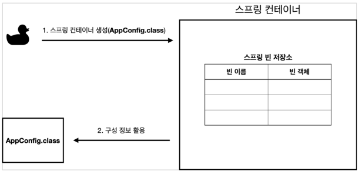

# 스프링 컨테이너와 스프링 빈

## 스프링 컨테이너 생성

```java
//스프링 컨테이너 생성
ApplicationContext applicationContext = new AnnotationConfigApplicationContext(AppConfig.class);
```

- `ApplicationContext` (인터페이스) - 스프링 컨테이너
    - new `AnnotationConfigApplicationContext`(AppConfig.class);
    - 이 클래스는 `ApplicationContext` 인터페이스의 구현체이다.
- 스프링 컨테이너는 XML을 기반으로 만들 수 있고, 애노테이션 기반의 자바 설정 클래스로 만들 수 있다.
  (직전에 AppConfig 를 사용했던 방식이 애노테이션 기반의 자바 설정 클래스로 스프링 컨테이너를 만든
  것이다.)


>💡 더 정확히는 스프링 컨테이너를 부를 때 `BeanFactory` , `ApplicationContext` 로 구분해서
>이야기한다. 
>`BeanFactory` 를 직접 사용하는 경우는 거의 없으므로 일반적으로 `ApplicationContext` 를 스프링 컨테이너라 한다.
>최상위가 `BeanFactory` 이고 그 밑에 `ApplicationContext`가 있음

1. 스프링 컨테이너 생성

   

2. 스프링 빈 등록

   

    - `@Bean` 붙은거 죄다 호출
    - bean의 이름은 주로 메소드 명인데 직접 부여도 가능 (`@Bean(name="memberService2")`)
    - bean의 이름은 unique해야함
        - 중복되면 다른 빈이 무시되거나, 기존 빈을 덮어버리거나 설정에 따라 오류가 발생할 수 있음
        - 최근에는 충돌나면 경고날림
        - 애매한건 하지마세요
    - return 반환하는 것을 빈 객체로 등록
3. 스프링 빈 의존관계 설정 - 준비

   

4. 스프링 빈 의존관계 설정 - 완료

   

    - 동적인 의존관계 (객체-인스턴스 의존관계)


>💡 **스프링으로 의존관계 주입 vs 자바로 의존관계 주입**
>- 스프링은 빈을 생성하고 의존관계를 주입하는 단계가 나뉘어져있음
>- 자바 코드로 스프링 빈을 등록하면 생성자를 호출하면서 의존관계 주입도 한번에 처리됨

## 컨테이너에 등록된 모든 빈 조회

```java
@Test
    @DisplayName("모든 빈 출력하기")
    void findAllBean(){
        String[] beanDefinitionNames = ac.getBeanDefinitionNames();
        for (String beanDefinitionName : beanDefinitionNames) {
            Object bean = ac.getBean(beanDefinitionName);
            System.out.println("name = " + beanDefinitionName + " object = " + bean);
        }
    }

    @Test
    @DisplayName("애플리케이션 빈 출력하기")
    void findApplicationBean(){
        String[] beanDefinitionNames = ac.getBeanDefinitionNames();
        for (String beanDefinitionName : beanDefinitionNames) {
            BeanDefinition beanDefinition = ac.getBeanDefinition(beanDefinitionName);//bean에 대한 메타데이터 정보

            // ROLE_APPLICATION : 일반적으로 사용자가 정의한 빈
            // ROLE_INFRASTRUCTURE : 스프링이 내부에서 사용하는 빈
            if(beanDefinition.getRole() == BeanDefinition.ROLE_APPLICATION){
                Object bean = ac.getBean(beanDefinitionName);
                System.out.println("name = " + beanDefinitionName + " object = " + bean);
            }
        }
    }
```

- `ac.getBeanDefinitionNames()` : 스프링에 등록된 모든 빈 이름을 조회한다.
- `ac.getBean()` : 빈 이름으로 빈 객체(인스턴스)를 조회한다.
- `ac.getRole()`
    - ROLE_APPLICATION : 일반적으로 사용자가 정의한 빈

        ```java
        name = org.springframework.context.annotation.internalConfigurationAnnotationProcessor object = org.springframework.context.annotation.ConfigurationClassPostProcessor@395b56bb
        name = org.springframework.context.annotation.internalAutowiredAnnotationProcessor object = org.springframework.beans.factory.annotation.AutowiredAnnotationBeanPostProcessor@256f8274
        name = org.springframework.context.annotation.internalCommonAnnotationProcessor object = org.springframework.context.annotation.CommonAnnotationBeanPostProcessor@68044f4
        name = org.springframework.context.event.internalEventListenerProcessor object = org.springframework.context.event.EventListenerMethodProcessor@52d239ba
        name = org.springframework.context.event.internalEventListenerFactory object = org.springframework.context.event.DefaultEventListenerFactory@315f43
        ```

    - ROLE_INFRASTRUCTURE : 스프링이 내부에서 사용하는 빈

        ```java
        name = appConfig object = hello.core.AppConfig$$EnhancerBySpringCGLIB$$283060ad@68fa0ba8
        name = memberService object = hello.core.member.MemberServiceImpl@6c5945a7
        name = memberRepository object = hello.core.member.MemoryMemberRepository@2f05be7f
        name = orderService object = hello.core.order.OrderServiceImpl@640f11a1
        name = discountPolicy object = hello.core.discount.RateDiscountPolicy@5c10f1c3
        ```


## 스프링 빈 조회 - 기본

- `ac.getBean(빈이름, 타입)`
- `ac.getBean(타입)`

## 스프링 빈 조회 - 동일한 타입이 둘 이상

- `ac.getBeansOfType()`

## 스프링 빈 조회 - 상속관계

- 부모 타입으로 조회하면 자식 타입도 함께 조회


> 실제 어플리케이션 개발 중 스프링 빈을 볼 일은 없지만 나중에 자동 의존관계 주입 시 잘 해결할 수 있음!
>

## BeanFactory와 ApplicationContext

인터페이스끼리 상속


- BeanFactory

  

    - 스프링 컨테이너의 최상위 인터페이스이며 스프링 빈을 관리하고 조회함
    - `getBean()` 을 제공
- ApplicationContext

  

    - BeanFactory 기능을 모두 상속받아서 제공한다. (BeanFactory 플러스 알파)
    - 빈을 관리하고 검색하는 기능을 BeanFactory가 제공해주는데, 그러면 둘의 차이가 뭘까?
    - 애플리케이션을 개발할 때는 빈은 관리하고 조회하는 기능은 물론이고, 수 많은 부가기능이 필요하다

  인터페이스 분리 원칙

  

    - 메시지소스를 활용한 국제화 기능
        - 예를 들어서 한국에서 들어오면 한국어로, 영어권에서 들어오면 영어로 출력
    - 환경변수
        - 로컬, 개발, 운영등을 구분해서 처리
    - 애플리케이션 이벤트
        - 이벤트를 발행하고 구독하는 모델을 편리하게 지원
    - 편리한 리소스 조회
        - 파일, 클래스패스, 외부 등에서 리소스를 편리하게 조회


>💡 - ApplicationContext는 BeanFactory의 기능을 상속받는다.
>- ApplicationContext는 빈 관리기능 + 편리한 부가 기능을 제공한다.
>- BeanFactory를 직접 사용할 일은 거의 없다. 부가기능이 포함된 ApplicationContext를 사용한다.
>- BeanFactory나 ApplicationContext를 스프링 컨테이너라 한다.

## 다양한 설정 형식 지원 - 자바 코드, XML


방금까지 했던 건 첫번째꺼!

### 어노테이션 기반 자바 코드 설정 사용

- `new AnnotationConfigApplicationContext(AppConfig.class)`
- `AnnotationConfigApplicationContext`

## XML 설정 사용

- 컴파일 없이 설정 정보를 변경할 수 있음ß

## 스프링 빈 설정 메타 정보 - BeanDefinition


- `BeanDefinition` : 빈 설정 메타정보
    - `@Bean`, `<bean>` 당 각각 하나씩 메타 정보가 생성됨
    - 추상화에만 의존하도록 설계됨


- `AnnotationConfigApplicationContext` 는 `AnnotatedBeanDefinitionReader` 를 사용해서
  AppConfig.class 를 읽고 `BeanDefinition` 을 생성한다.

- `GenericXmlApplicationContext` 는 `XmlBeanDefinitionReader` 를 사용해서 appConfig.xml 설정 정보를 읽고 `BeanDefinition` 을 생성한다.

- `ac.getBeanDefinitionNames()`
- `ac.getBeanDefinition(beanDefinitionName)`

- `BeanDefinition`을 직접 생성해서 스프링 컨테이너에 등록할 수 도 있다. 하지만 실무에서 `BeanDefinition`을 직접 정의하거나 사용할 일은 거의 없다.
- 스프링이 다양한 형태의 설정 정보를 `BeanDefinition`으로 추상화해서 사용하는 것 정도만 이해하면 된다
- 가끔 스프링 코드나 스프링 관련 오픈 소스의 코드를 볼 때, `BeanDefinition` 이라는 것이 보일 때가 있다. 이때 이러한 메커니즘을 떠올리면 된다.

```
beanDefinitionName = appConfig beanDefinition =  Generic bean: class [hello.core.AppConfig$$EnhancerBySpringCGLIB$$61c69356]; scope=singleton; abstract=false; lazyInit=null; autowireMode=0; dependencyCheck=0; autowireCandidate=true; primary=false; factoryBeanName=null; factoryMethodName=null; initMethodName=null; destroyMethodName=null
beanDefinitionName = memberService beanDefinition =  Root bean: class [null]; scope=; abstract=false; lazyInit=null; autowireMode=3; dependencyCheck=0; autowireCandidate=true; primary=false; factoryBeanName=appConfig; factoryMethodName=memberService; initMethodName=null; destroyMethodName=(inferred); defined in hello.core.AppConfig
beanDefinitionName = memberRepository beanDefinition =  Root bean: class [null]; scope=; abstract=false; lazyInit=null; autowireMode=3; dependencyCheck=0; autowireCandidate=true; primary=false; factoryBeanName=appConfig; factoryMethodName=memberRepository; initMethodName=null; destroyMethodName=(inferred); defined in hello.core.AppConfig
beanDefinitionName = orderService beanDefinition =  Root bean: class [null]; scope=; abstract=false; lazyInit=null; autowireMode=3; dependencyCheck=0; autowireCandidate=true; primary=false; factoryBeanName=appConfig; factoryMethodName=orderService; initMethodName=null; destroyMethodName=(inferred); defined in hello.core.AppConfig
beanDefinitionName = discountPolicy beanDefinition =  Root bean: class [null]; scope=; abstract=false; lazyInit=null; autowireMode=3; dependencyCheck=0; autowireCandidate=true; primary=false; factoryBeanName=appConfig; factoryMethodName=discountPolicy; initMethodName=null; destroyMethodName=(inferred); defined in hello.core.AppConfig
```

```
beanDefinitionName = memberService beanDefinition =  Generic bean: class [hello.core.member.MemberServiceImpl]; scope=; abstract=false; lazyInit=false; autowireMode=0; dependencyCheck=0; autowireCandidate=true; primary=false; factoryBeanName=null; factoryMethodName=null; initMethodName=null; destroyMethodName=null; defined in class path resource [appConfig.xml]
beanDefinitionName = memberRepository beanDefinition =  Generic bean: class [hello.core.member.MemoryMemberRepository]; scope=; abstract=false; lazyInit=false; autowireMode=0; dependencyCheck=0; autowireCandidate=true; primary=false; factoryBeanName=null; factoryMethodName=null; initMethodName=null; destroyMethodName=null; defined in class path resource [appConfig.xml]
beanDefinitionName = orderService beanDefinition =  Generic bean: class [hello.core.order.OrderServiceImpl]; scope=; abstract=false; lazyInit=false; autowireMode=0; dependencyCheck=0; autowireCandidate=true; primary=false; factoryBeanName=null; factoryMethodName=null; initMethodName=null; destroyMethodName=null; defined in class path resource [appConfig.xml]
beanDefinitionName = discountPolicy beanDefinition =  Generic bean: class [hello.core.discount.RateDiscountPolicy]; scope=; abstract=false; lazyInit=false; autowireMode=0; dependencyCheck=0; autowireCandidate=true; primary=false; factoryBeanName=null; factoryMethodName=null; initMethodName=null; destroyMethodName=null; defined in class path resource [appConfig.xml]
```

직접 빈 선언

팩토리 메소드 사용 (appConfig가 제공하는 메서드를 통해 제공)