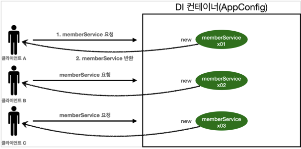

# 싱글톤 컨테이너

---

- 객체 인스턴스가 하나만 있는 패턴
- 대부분의 스프링 애플리케이션은 웹 애플리케이션임
    - 웹에는 동시에 요청이 들어감
    - 고객이 3번 요청하면 요청이 3번 들어감

  

- 이전에 만들었던 `AppConfig`는 요청이 들어올 때마다 객체를 새로 생성함
- 해당 객체를 하나만 만들고 공유하도록 설계하면 됨 → 싱글톤 패턴

## 싱글톤 패턴

- 객체 인스턴스를 2개 이상 생성하지 못하도록 막아야 한다.
- private 생성자를 사용해서 외부에서 임의로 new 키워드를 사용하지 못하도록 막아야 한다.

```java
public class SingletoneService{

		// 자기자신을 static으로 가지고있음
		private static final SingletoneServiceinstance= new SingletoneService(); 

    // 다른 곳에서 new로 생성 못함
		// 이 메소드를 통해서만 조회 가능함
    public static SingletoneService getInstance(){
			return instance;
		}
		
		// 생성자를 private로 막아야함
		private SingletoneService(){
    }
		
		public void logic(){
		System.out.println("싱글톤 객체 로직 호출");
		}

}
```

- private으로 new 키워드를 막아두었다.
- 호출할 때 마다 같은 객체 인스턴스를 반환하는 것을 확인할 수 있다.
- 잘 설계한 객체는 컴파일 오류가 나도록 설계한 객체


>💡 싱글톤 패턴을 구현하는 방법은 여러가지가 있다. 여기서는 객체를 미리 생성해두는 가장 단순하고
>안전한 방법을 선택했다. (지연으로 처리하는 방법도 있고…)

- 이미 만들어진 객체를 사용하기 때문에 자원을 효율적으로 사용할 수 있음 ⇒ 성능향상!

### 싱글톤 패턴 문제점

- 싱글톤 패턴을 구현하는 코드 자체가 많이 들어간다.
- 의존관계상 클라이언트가 구체 클래스에 의존한다 ⇒ DIP를 위반
    - `구체클래스.getInstance()` 해서 꺼내야함
- 클라이언트가 구체 클래스에 의존해서 OCP 원칙을 위반할 가능성이 높다.
- 테스트하기 어렵다.
- 내부 속성을 변경하거나 초기화 하기 어렵다.
- private 생성자로 자식 클래스를 만들기 어렵다.
- 결론적으로 유연성이 떨어진다.
- 안티패턴으로 불리기도 한다.

## 싱글톤 컨테이너

- **스프링 컨테이너**는 **싱글톤 컨테이너**
    - 싱글톤 패턴을 적용하지 않아도 싱글톤으로 관리할 수 있음
    - 추가적인 코드 필요 없음
    - DIP, OCP, 테스트, private 생성자로 부터 자유롭게 싱글톤 사용 가능
- **싱글톤 레지스트리** : 싱글톤 객체를 생성하고 관리하는 기능


- 요청이 올 때 마다 객체를 생성하는 것이 아니라, 이미 만들어진 객체를 공유해서 효율적으로 재사용

> 스프링의 기본 빈 등록 방식은 싱글톤이지만, 싱글톤 방식만 지원하는 것은 아니다. 요청할 때 마다
새로운 객체를 생성해서 반환하는 기능도 제공한다. 하지만 99%는 싱글톤!
(자세한 내용은 빈 스코프에서)
>

## ⭐️ 싱글톤 방식의 주의점

- 싱글톤 패턴이든, 스프링 같은 싱글톤 컨테이너를 사용하든, 객체 인스턴스를 하나만 생성해서 공유하는 싱글톤 방식은 여러 클라이언트가 하나의 같은 객체 인스턴스를 공유하기 때문에 싱글톤 객체는 상태를 유지(stateful)하게 설계하면 안된다.
    - statefulService

        ```java
        public class StatefulService {
        
            private int price; // 상태를 유지하는 필드 10000->20000
        
            public int order(String name, int price){
                System.out.println("name = " + name  + " price = " + price);
        //        this.price = price; // 여기가 문제
                return price;
            }
        
            public int getPrice(){
                return price;
            }
        }
        ```

- 무상태(stateless)로 설계해야 한다!
    - 특정 클라이언트에 의존적인 필드가 있으면 안된다.
    - 특정 클라이언트가 값을 변경할 수 있는 필드가 있으면 안된다!
    - 가급적 읽기만 가능해야 한다.
    - 필드 대신에 자바에서 공유되지 않는, 지역변수, 파라미터, ThreadLocal 등을 사용해야 한다.
- **스프링 빈의 필드에 공유 값을 설정하면 정말 큰 장애가 발생할 수 있다!!!**
- **진짜 공유 필드는 조심해야한다! 스프링 빈은 항상 무상태(stateless)로 설계하자**

## @Configuration과 싱글톤

- 스프링이 싱글톤으로 동작하는 것을 코드로 확인해보자

```java
@Configuration
public class AppConfig {
	@Bean
	public MemberService memberService() {
	System.out.println("call AppConfig.memberService");
	    return new MemberServiceImpl(memberRepository());
	}
	
	@Bean
	public MemberRepository memberRepository() {
	System.out.println("call AppConfig.memberRepository");
	    return new MemoryMemberRepository();
	}
	
	@Bean
	public OrderService orderService(){
	System.out.println("call AppConfig.orderService");
	    return new OrderServiceImpl(memberRepository(), discountPolicy());
	}
}
```

```java
public class ConfigurationSingletoneTest{
		@Test
    void configurationTest(){
				AnnotationConfigApplicationContext ac = new AnnotationConfigApplicationContext(AppConfig.class);

        MemberServiceImpl memberService = ac.getBean("memberService", MemberServiceImpl.class);
        OrderServiceImpl orderService = ac.getBean("orderService", OrderServiceImpl.class);
        MemberRepository memberRepository = ac.getBean("memberRepository", MemberRepository.class);

        MemberRepository memberRepository1 = memberService.getMemberRepository();
        MemberRepository memberRepository2 = orderService.getMemberRepository();

        System.out.println("memberService -> memberRepository = " + memberRepository1);
        System.out.println("orderService -> memberRepository = " + memberRepository2);
        System.out.println("memberRepository = " + memberRepository);

				assertThat(memberService.getMemberRepository()).isSameAs(memberRepository);
				assertThat(orderService.getMemberRepository()).isSameAs(memberRepository);
		}
}
```

## @Configuration과 바이트코드 조작의 마법

```java
AnnotationConfigApplicationContext ac = new AnnotationConfigApplicationContext(AppConfig.class);
AppConfig bean = ac.getBean(AppConfig.class);
System.out.println("bean = " + bean.getClass());

//bean = class hello.core.AppConfig$$EnhancerBySpringCGLIB$$910da055
```

⇒ 내가 만든 class가 아니라 이상하게 나옴..! (`EnhancerBySpringCGLIB`)


- 바이트코드 조작 라이브러리를 사용해서 AppConfig 클래스를 상속받은 다른 임의의 클래스를 생성함
    - 예상 코드

        ```java
        @Bean
        public MemberRepository memberRepository() {
        	 if (memoryMemberRepository가 이미 스프링 컨테이너에 등록되어 있으면?) {
        		 return 스프링 컨테이너에서 찾아서 반환;
        	 } 
        	else { //스프링 컨테이너에 없으면
        		 기존 로직을 호출해서 MemoryMemberRepository를 생성하고 스프링 컨테이너에 등록
        		 return 반환
        	 }
        }
        ```

- 임의의 다른 클래스가 싱글톤이 보장되도록 함


>💡 AppConfig@CGLIB는 AppConfig의 자식 타입이므로, AppConfig 타입으로 조회 할 수 있다.


- `@Configuration` 을 적용하지 않고, `@Bean` 만 적용하면??
    - `@Bean`만 사용해도 스프링 빈으로 등록되지만, 싱글톤을 보장하지 않는다.
    - CGLIB 기술 없이 순수한 `AppConfig`로 스프링 빈에 등록
    - memberRepository() 처럼 의존관계 주입이 필요해서 메서드를 직접 호출할 때 싱글톤을 보장하지 않는다 (직접 `new`해준거랑 똑같이되어서 OCP 위반)
- `@Configuration` 을 붙이면 바이트코드를 조작하는 CGLIB 기술을 사용해서 싱글톤을 보장

**⇒ 스프링 설정 정보는 항상 @Configuration 을 사용하자**