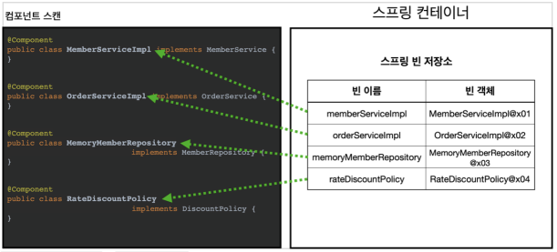

# 컴포넌트 스캔

---

## 컴포넌트 스캔과 의존관계 자동 주입 시작하기

- 등록해야할 빈이 실무에서는 많다
- 스프링은 설정 정보다 없어도 자동으로 스프링 빈을 등록하는 컴포넌트 스캔이라는 기능이 있음
- 의존 관계도 자동으로 주입하는 `@Autowired`라는 기능도 제공함
- 예제 코드 살리기 위한 추가 조작
    - excludeFilters

    ```java
    @Configuration
    @ComponentScan(
    				// AppConfig를 제외하기 위함
            excludeFilters = @ComponentScan.Filter(type = FilterType.ANNOTATION, classes = Configuration.class)
    )
    public class AutoAppConfig{
    }
    ```

- 컴포넌트 스캔은 이름 그대로 `@Component` 애노테이션이 붙은 클래스를 스캔해서 스프링 빈으로 등록


>💡 `@Configuration` 이 컴포넌트 스캔의 대상이 된 이유도 `@Configuration` 소스코드를 열어보면
>`@Component` 애노테이션이 붙어있기 때문

**⇒ @Component를 붙여주자!**

- 의존관계 자동 주입 : `Component` + `Autowired`
- @ComponentScan 은 @Component 가 붙은 모든 클래스를 스프링 빈으로 등록한다.
    - 이때 스프링 빈의 기본 이름은 클래스명을 사용하되 맨 앞글자만 소문자를 사용한다.
    - 빈 이름 기본 전략: MemberServiceImpl 클래스 memberServiceImpl
    - 빈 이름 직접 지정: 만약 스프링 빈의 이름을 직접 지정하고 싶으면 @Component("memberService2") 이런식으로 이름을 부여하면 된다.




- 타입으로 조회하여 자동으로 해당 스프링 빈을 찾아서 주입함
- 더 자세한 내용은 의존 관계 자동 주입에서…

# 탐색 위치와 기본 스캔 대상

- `basePackages` : 탐색할 패키지의 시작 위치를 지정한다
- 만약 지정하지 않으면 `@ComponentScan` 이 붙은 설정 정보 클래스의 패키지가 시작 위치가 된다

### 권장 방법

- 패키지 위치를 지정하지 않고, 설정 정보 클래스의 위치를 프로젝트 최상단에 두는 것
- 스프링 부트도 위 방법으로 제공함
- 스프링 부트를 사용하면 스프링 부트의 대표 시작 정보인 `@SpringBootApplication` 를 이
  프로젝트 시작 루트 위치에 두는 것이 관례이다. (그리고 이 설정안에 바로 `@ComponentScan` 이 들어있다!)


### 컴포넌트 스캔 기본 대상

- `@Component` : 컴포넌트 스캔에서 사용
- `@Controlller` : 스프링 MVC 컨트롤러에서 사용
- `@Service` : 스프링 비즈니스 로직에서 사용
    - 특별한 처리를 하지는 않지만 개발자들이 핵심 비즈니스 로직이 여기 있구나 하고 비즈니스 계층을 인식하는데 도움이 됨

  

- `@Repository` : 스프링 데이터 접근 계층에서 사용. 데이터 계층의 예외를 스프링 예외로 변환.
- `@Configuration` : 스프링 설정 정보에서 사용

어노테이션은 하나의 메타 정보임

>💡 사실 애노테이션에는 상속관계라는 것이 없다. 그래서 이렇게 애노테이션이 특정 애노테이션을 들고
>있는 것을 인식할 수 있는 것은 자바 언어가 지원하는 기능은 아니고, 스프링이 지원하는 기능이다.

>💡 `useDefaultFilters` 옵션은 기본으로 켜져있는데, 이 옵션을 끄면 기본 스캔 대상들이 제외된다.
>그냥 이런 옵션이 있구나 정도 알고 넘어가자.


## 필터

- `includeFilters` : 컴포넌트 스캔 대상을 추가로 지정한다.
- `excludeFilters` : 컴포넌트 스캔에서 제외할 대상을 지정한다.

FilterType 옵션

| ANNOTATION | 기본값, 애노테이션을 인식해서 동작한다. |
| --- | --- |
| ASSIGNABLE_TYPE | 지정한 타입과 자식 타입을 인식해서 동작한다. |
| ASPECTJ | AspectJ 패턴 사용 |
| REGEX | 정규 표현식 |
| CUSTOM | TypeFilter 이라는 인터페이스를 구현해서 처리 |

>💡 `@Component` 면 충분하기 때문에, `includeFilters` 를 사용할 일은 거의 없다. `excludeFilters`
>는 여러가지 이유로 간혹 사용할 때가 있지만 많지는 않다.
>특히 최근 스프링 부트는 컴포넌트 스캔을 기본으로 제공하는데, 개인적으로는 옵션을 변경하면서 사용하기 보다는 스프링의 기본 설정에 최대한 맞추어 사용하는 것을 권장하고, 선호하는 편이다.

## 중복 등록과 충돌

컴포넌트 스캔에서 같은 빈 이름을 등록하면 어떻게 될까?

1. 자동 빈 등록 vs 자동 빈 등록

   

2. 수동 빈 등록 vs 자동 빈 등록
    - 수동 빈 등록이 우선권을 가진다

최근엔 자동 등록과 수동 등록이 충돌나면 오류가 나도록 함


(단, [application.properties](http://application.properties) 가면 override 해서 조정할 수 있음 - `spring.main.allow-bean-definition-overriding=true`)