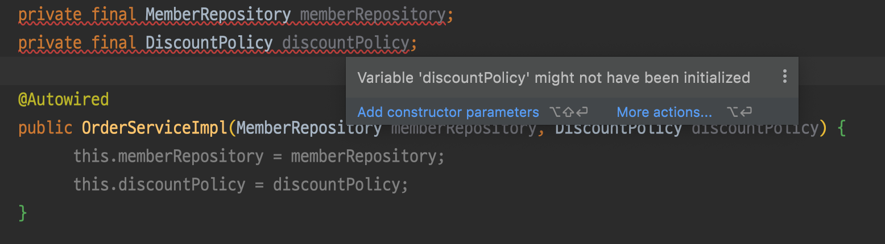

# 다양한 의존관계 주입 방법

1. 생성자 주입
2. 수정자 주입(setter 주입)
3. 필드 주입
4. 일반 메서드 주입

### 생성자 주입

```java
@Component
public class OrderServiceImpl implements OrderService{

    // 인터페이스에만 의존하고 구체적인 구현체는 전혀 모름
    private final MemberRepository memberRepository;
    private final DiscountPolicy discountPolicy;

    @Autowired
    public OrderServiceImpl(MemberRepository memberRepository, DiscountPolicy discountPolicy) {
        this.memberRepository = memberRepository;
        this.discountPolicy = discountPolicy;
    }

}
```

- 생성자 부르면서 @Autowired
- 특징
    - 생성자 호출시점에 딱 1번만 호출되는 것이 보장됨 (그 이후에 변하지 않음)
    - 불변, 필수 의존관계에 사용 (생성자는 왠만하면 파라미터를 다 전달)
- **생성자가 딱 1개만 있으면 @Autowired를 생략해도 자동 주입됨 (스프링 빈에만 해당)**

### 수정자 주입

```java
@Component
public class OrderServiceImpl implements OrderService {
		
		private MemberRepository memberRepository;
		private DiscountPolicy discountPolicy;
		
		@Autowired
		public void setMemberRepository(MemberRepository memberRepository) {
		 this.memberRepository = memberRepository;
		}
		
		@Autowired
		public void setDiscountPolicy(DiscountPolicy discountPolicy) {
		 this.discountPolicy = discountPolicy;
		}

}
```

- 스프링은 빈을 생성하는 단계와 의존관계 주입하는 단계 2단계로 나타난다
    - 생성자는 어쩔 수 없이 생성단계에서 의존관계가 주입됨
- 수정자 주입하면 생성자는 필요 없음
- 특징
    - 선택, 변경 가능성이 있는 의존관계에 사용 (선택적 의존관계 주입, `required = false`)
    - 자바빈 프로퍼티 규약의 수정자 메서드 방식을 사용


>💡 **자바빈 프로퍼티**
>자바에서는 과거부터 필드의 값을 직접 변경하지 않고, `setXxx`, `getXxx` 라는 메서드를 통해서 값을 읽거나 수정하는 규칙을 만들었는데, 그것이 자바빈 프로퍼티 규약이다.

### 필드 주입

```java
@Component
public class OrderServiceImpl implements OrderService {
	 @Autowired
	 private MemberRepository memberRepository;
	 @Autowired
	 private DiscountPolicy discountPolicy;
}
```

- 쓰면 안된다
- setter도 따로 만들어야한다
- 주로 안쓰는게 권장되지만 테스트 할 때는 종종 씀

### 일반 메서드 주입

```java
@Component
public class OrderServiceImpl implements OrderService{

    // 인터페이스에만 의존하고 구체적인 구현체는 전혀 모름
    private MemberRepository memberRepository;
    private DiscountPolicy discountPolicy;

    @Autowired
    public OrderServiceImpl(MemberRepository memberRepository, DiscountPolicy discountPolicy) {
        this.memberRepository = memberRepository;
        this.discountPolicy = discountPolicy;
    }

    @Autowired
    public void init(MemberRepository memberRepository, DiscountPolicy discountPolicy){
        this.memberRepository = memberRepository;
        this.discountPolicy = discountPolicy;
    }
}
```

- 한 번에 여러 필드를 주입 받을 수 있음
- 일반적으로 잘 안쓴다

> 의존관계 자동 주입은 스프링 컨테이너가 관리하는 스프링 빈이어야 동작함

## 옵션 처리

- 주입할 스프링 빈이 없어도 동작해야할 때가 있음
- `@Autowired` 만 사용하면 `required` 옵션의 기본값이 true 로 되어 있어서 자동 주입 대상이 없으면 오류가 발생한다
1. `@Autowired(required=false)` : 자동 주입할 대상이 없으면 수정자 메서드 자체가 호출 안됨
2. `org.springframework.lang.@Nullable` : 자동 주입할 대상이 없으면 null이 입력된다.
3. `Optional<>` : 자동 주입할 대상이 없으면 Optional.empty 가 입력된다.

```java
static class TestBean{
    @Autowired(required = false)
    public void setNoBean1(Member noBean1){
        // spring container에 관리되는 것이 없음 -> 의존관계 없음 -> 호출X
        System.out.println("noBean1 = " + noBean1);
    }
    
    @Autowired
    public void setNoBean2(@Nullable Member noBean2){
        System.out.println("noBean2 = " + noBean2);
    }
    
    @Autowired
    public void setNoBean3(Optional<Member> noBean3){
        System.out.println("noBean3 = " + noBean3);
    }

}
```

## 생성자 주입을 선택해라!

- 다른 DI 프레임워크도 주로 생성자 주입을 추천함

### 불변

- final 키워드 사용 가능
    - 초기화 단계에 안들어오면 컴파일 에러
      

- 애플리케이션 종료 때까지 변화하지 않음
- 수정자 주입이면 setXXX를 public으로 열어야하는데, 그다지 좋은 방법이 아님

**⇒ 불면하게 설계 가능**

### 누락

- 수정자 의존 방식인 경우 의존관계 주입 누락 가능
- 의존 관계 파악이 어려움

```java
@Test
void createOrder(){
	// 테스트를 위해 데이터를 넣어줌
  MemoryMemberRepository memberRepository = new MemoryMemberRepository();
  memberRepository.save(new Member(1L, "name", Grade.VIP));
	
	// 수정자 주입이면 이렇게 되다가 컴파일 에러가 날 수 있음
	//OrderServiceImpl orderService = new OrderServiceImpl();    
	
	OrderServiceImpl orderService = new OrderServiceImpl(new MemoryMemberRepository(), new FixDiscountPolicy());
  Order order = orderService.createOrder(1L, "itemA", 1000);
  Assertions.assertThat(order.getMemberId()).isEqualTo(1L);
}
```

> 수정자 주입을 포함한 나머지 주입 방식은 모두 생성자 이후에 호출되므로, 필드에 final 키워드를 사용할 수 없다. 오직 생성자 주입 방식만 final 키워드를 사용할 수 있다

> 필드 주입은 왠만하면 하지 말자
> - 테스트 할 때도 스프링을 사용하지 않으면 아예 불가해짐

## 롬복과 최신 트랜드

- 생성자 주입을 하면 단점은 코드량이 많아짐
- 생성자에 final 키워드롤 사용하게 됨 (99%가 불변!)
- 필드 injection은 `@Autowired`하나면 되는데…
- 생성자가 하나면 `@Autowired` 생략 가능

- `@RequiredArgsConstructor`
    - final 붙은거 기준으로 생성자 생성
    - 코드가 없어보이지만 실제 class 열어보면 생성자 코드가 들어가있음

## 조회 빈이 2개 이상 - 문제

- 이름만 다르고 완전히 똑같은 타입의 스프링 빈 2개
- 하위 타입으로 지정하면 DIP를 위반하고 유연성이 떨어짐

**⇒ 특정 어노테이션을 통해 해결 가능**

## @Autowired 필드 명, @Qualifier, @Primary

1. `@Autowired` 필드 명 매칭
    - 빈 이름이나 파라미터 이름으로 추가 매칭

    ```java
    @Autowired
    private DiscountPolicy rateDiscountPolicy; // 필드명
    
    @Autowired
    public OrderServiceImpl(MemberRepository memberRepository, DiscountPolicy rateDiscountPolicy) {
    	this.memberRepository = memberRepository;
      this.discountPolicy = rateDiscountPolicy; // 파라미터명
    }
    ```

2. `@Qualifier`
    - 추가 구분자 (빈 이름을 바꾸는 것은 아님)
    - 모든 코드에 붙여줘야하는 것이 단점
    - `@Qualifier`안에 명을 못찾으면, 그 이름을 가진 스프링 빈을 추가로 찾지만, 이런 식으로는 쓰지 않는 것이 좋다 (그래도 못 찾으면 예외가 터짐)

    ```java
    @Component
    @Qualifier("mainDiscountPolicy")
    public class RateDiscountPolicy implements DiscountPolicy{ }
    ```

    ```java
    @Autowired
    public OrderServiceImpl(MemberRepository memberRepository, @Qualifier("mainDiscountPolicy") DiscountPolicy discountPolicy) {
        this.memberRepository = memberRepository;
        this.discountPolicy = discountPolicy;
    }
    ```

3. `@Primary`
    - 붙은 애가 최상위로 잡히면서 주입됨
    - 추가로 안붙여도 되어서 현업에서 은근 자주 쓰임
        - ex) database 붙일 때

    ```java
    @Component
    @Primary
    public class RateDiscountPolicy implements DiscountPolicy{ }
    ```

> `**@Qualifier` vs `@Primary`**
>- `@Qualifier` 가 이긴다
>- 자세한 것이 우선권을 가져간다
>- 스프링은 넓은 선택범위보다 좁은 선택범위의 우선권이 높음

## 어노테이션 직접 만들기

- 만들고 싶은 어노테이션에 위에 붙어있는 어노테이션을 모아서 데려옴

```java
@Target({ElementType.FIELD, ElementType.METHOD, ElementType.PARAMETER, ElementType.TYPE, ElementType.ANNOTATION_TYPE})
@Retention(RetentionPolicy.RUNTIME)
@Inherited
@Documented
@Qualifier("mainDiscountPolicy")
public @interface MainDiscountPolicy {
}
```

- 어노테이션에는 상속의 개념이 없음
- Java에서 지원하는 기능이 아니라 스프링이 제공하는 기능임
- 뚜렷한 목적 없이 무분별하게는 하지 말자

## 조회한 빈이 모두 필요할 때, List, Map

- 전략 패턴
- 다형성 코드
- 동적으로 bean을 받을 때 Map으로 받으면 편리함!

```java
static class DiscountService{
  private final Map<String, DiscountPolicy> policyMap;
  private final List<DiscountPolicy> policies;

  @Autowired
  public DiscountService(Map<String, DiscountPolicy> policyMap, List<DiscountPolicy> policies) {
    this.policyMap = policyMap;
    this.policies = policies;
    System.out.println("policyMap = " + policyMap);
    System.out.println("policies = " + policies);
  }

  public int discount(Member member, int price, String discountCode) {
    DiscountPolicy discountPolicy = policyMap.get(discountCode);
    return discountPolicy.discount(member, price);
  }
}
```

```java
public class AllBeanTest {
  @Test
  void findAllBean(){
    ApplicationContext ac = new AnnotationConfigApplicationContext(AutoAppConfig.class, DiscountService.class);

    DiscountService discountService = ac.getBean(DiscountService.class);
    Member member = new Member(1L, "userA", Grade.VIP);
    int discountPrice = discountService.discount(member, 1000, "fixDiscountPolicy");

    assertThat(discountService).isInstanceOf(DiscountService.class);
    assertThat(discountPrice).isEqualTo(1000);

    int rateDiscountPrice = discountService.discount(member, 20000, "rateDiscountPolicy");
    assertThat(rateDiscountPrice).isEqualTo(2000);
  }
}
```

### Map으로 Bean을 받아오는 과정

> TODO
>

## 자동, 수동의 올바른 실무 운영 기준

- 편리한 자동 기능을 기본으로 사용함
    - 스프링 부트는 컴포넌트 스캔을 그냥 깔고있음
    - 스프링 빈을 하나 등록할 때 `@Component` 만 넣어주면 끝나는 일을 `@Configuration` 설정 정보에 가서 `@Bean` 을 적고, 객체를 생성하고, 주입할 대상을 일일이 적어주는 과정은 상당히 번거롭다
    - 설정정보 관리 자체도 힘듦
- 자동 빈 등록을 사용해도 OCP나 DIP를 지킬 수 있음
- 수동 빈 등록은 언제 할까?
    - *업무 로직 빈 ⇒ 자동 기술 사용*
        - 웹을 지원하는 컨트롤러, 핵심 비즈니스 로직이 있는 서비스, 데이터 계층의 로직을 처리하는 리포지토리등이 모두 업무 로직이다.
        - 보통 비즈니스 요구사항을 개발할 때 추가되거나 변경된다.
        - 숫자가 굉장히 많고 유사한 패턴이 있음
    - *기술 지원 빈 ⇒ 수동 빈으로 등록*
        - 기술적인 문제나 공통 관심사(AOP)를 처리할 때 주로 사용된다.
        - 데이터베이스 연결이나, 공통 로그 처리 처럼 업무 로직을 지원하기 위한 하부 기술이나 공통 기술
        - 수가 매우 적고 애플리케이션 전반에 걸쳐 광범위하게 영향을 미침
- 단, 비즈니스 로직 중에서 다형성을 적극 활용할 때는 수동 빈으로 등록
    - 어떤 빈이 주입되는지 한번에 파악되기 힘듦

    ```java
    @Configuration
    public class DiscountPolicyConfig {
     @Bean
     public DiscountPolicy rateDiscountPolicy() {
    	 return new RateDiscountPolicy();
     }
     @Bean
     public DiscountPolicy fixDiscountPolicy() {
    	 return new FixDiscountPolicy();
     }
    }
    ```

    - 자동으로 하려면 최소한 패키지라도 묶여있어야함

> 💡 **[예외] 스프링과 스프링 부트가 자동으로 등록하는 수 많은 빈**
>- 스프링 자체를 잘 이해하고 스프링의 의도대로 잘 사용하는게 중요함
>- 스프링 부트의 경우 DataSource 같은 데이터베이스 연결에 사용하는 기술 지원 로직까지 내부에서 자동으로 등록하는데, 이런 부분은 메뉴얼을 잘 참고해서
>  스프링 부트가 의도한 대로 편리하게 사용하면 된다.
>- 직접 기술 지원 객체를 스프링 빈으로 등록한다면 수동으로 등록해서 명확하게 들어내는 것이 좋다.

**⇒ 편리한 자동 기능을 기본으로 사용하자**  
**⇒ 직접 등록하는 기술 지원 객체는 수동 등록**  
**⇒ 다형성을 적극 활용하는 비즈니스 로직은 수동 등록을 고민해보자**