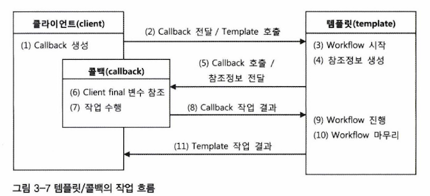

# 3.5 템플릿과 콜백

전략 패턴은 복잡하지만 바뀌지 않는 일정한 패턴을 갖는 작업 흐름이 존재하고 그중 일부분만 자주 바꿔서 사용해야 하는 경우에 적합한 구조임

- 템플릿 : 전략 패턴의 컨텍스트
- 콜백 : 익명 내부 클래스로 만들어지는 오브젝트

>💡 **템플릿 (Template)**
>- 어떤 목적을 위해 미리 만들어둔 모양이 있는 틀
>- ex. JSP는 HTML이라는 고정된 부분에 EL과 스크립릿이라는 변하는 부분을 넣은 일종의 템플릿 파일
>- 템플릿 메소드 패턴은 고정된 틀의 로직을 가진 템플릿 메소드를 슈퍼클래스에 두고, 바뀌는 부분을 서브클래스의 메소드에 두는 구조로 이루어짐


>💡 **콜백 (callback)**
>- 실행되는 것을 목적으로 다른 오브젝트의 메소드에 전달되는 오브젝트를 말함
>- 파라미터로 전달되지만 값을 참조하기 위한 것이 아니라 특정 로직을 담은 메소드를 실행시키기 위해 사용됨
>- 자바에서는 메소드 자체를 파라미터로 전달할 방법이 없기에 메소드가 담긴 오브젝트를 전달해야함 (functional object)
>- [https://jojoldu.tistory.com/232](https://jojoldu.tistory.com/232)


## 3.5.1 템플릿/콜백의 동작원리

- 전략 패턴과 달리, 템플릿/콜백 패턴의 콜백은 보통 단일 메소드 인터페이스를 사용함
- 하나의 템플릿에서 여러 가지 종류의 전략을 사용해야한다면 하나 이상의 콜백 오브젝트를 사용할 수도 있음
- 콜백은 일반적으로 하나의 메소드를 가진 인터페이스를 구현한 익명 내부 클래스로 만들어짐



- *클라이언트*
    - 템플릿 안에서 실행될 로직을 담은 콜백 오브젝트 생성 및 콜백이 참조할 정보 제공
- *템플릿*
    - 정해진 작업 흐름에 따라 작업하다가 내부에서 생성한 참조정보를 가지고 콜백 오브젝트의 메소드를 호출
    - 후에 콜백이 돌려준 정보를 사용해서 작업을 마저 수행함
- *콜백*
    - 클라이언트 메소드에 있는 정보와 템플릿이 제공한 참조정보를 이용해서 작업을 수행하고 그 결과를 다시 템플릿에 돌려줌

**⇒ DI 방식의 전략 패턴 구조**

**⇒ 메소드 레벨에서의 DI**

특징

- 매번 메소드 단위로 사용할 오브젝트를 새롭게 전달받는다는 것이 특징
- 콜백 오브젝트가 내부 클래스로서 자신이 생성한 클라이언트 메소드 내의 정보를 직접 참조함
- 클라이언트와 콜백이 강하게 결함됨

### JdbcContext에 적용된 템플릿/콜백


- 템플릿의 작업 흐름이 좀 더 복잡한 경우에는 한 번 이상 콜백을 호출하기도 하고 여러 개의 콜백을 클라이언트로부터 받아서 사용하기도 함

## 3.5.2 편리한 콜백의 재활용

- 클라이언트의 메소드가 간결해지고 최소한의 데이터 액세스 로직만 갖고있게 됨
- DAO메소드에서 매번 익명 내부 클래스를 사용하기 때문에 상대적으로 코드를 작성하고 읽기가 불편함

### 콜백의 분리와 재활용

- 복잡한 익명 내부 클래스의 사용을 최소화해보자!
    - 재사용 가능한 코드를 찾아 분리함

```java
public void deleteAll() throws SQLException {
	jdbcContextWithStatementStrategy(
		// 변하지 않는 콜백 클래스 정의와 오브젝트 생성
		new StatementStrategy() {
			public PreparedStatement makePreparedStatment(Connection c) throws SQLException {
				return c.preparedStatement("delete from users"); // 변하는 SQL 문장
			}
		}
	);
}
```

→ 유사한 내용의 콜백 오브젝트가 반복될 가능성이 높음

```java
public void deleteAll() throws SQLException {
	executeSql("delete from users"); // 변하는 SQL 문장
}
```

```java
private void executeSql(final String query) throws SQLException {
	this.jdbcContext.workWithStatementStrategy(
		// 변하지 않는 콜백 클래스 정의와 오브젝트 생성
		new StatementStrategy() {
			public PreparedStatement makePreparedStatment(Connection c) throws SQLException {
				return c.preparedStatement(query);
			}
		}
	);
}
```

→ SQL을 담은 파라미터를 final로 선언해서 익명 내부 클래스인 콜백 안에서 직접 사용할 수 있게 하는 것만 주의하면됨

→ 복잡한 익명 내부 클래스인 콜백을 직접 만들 필요도 없음

### 콜백과 템플릿의 결합

- 템플릿은 `JdbcContext` 클래스가 아니라 `workWithStatementStrategy()` 메소드이므로 `JdbcContext` 클래스로 콜백 생성과 템플릿 호출이 담긴 `executeSql()`메소드를 옮긴다해도 문제되지 않음

```java
public class JdbcContext {
	//...//
	public void executeSql(final String query) throws SQLException {
		workWithStatementStrategy(
			new StatementStrategy() {
				public PreparedStatement makePreparedStatment(Connection c) throws SQLException {
					return c.preparedStatement(query);
				}
			}
		);
	}
```

```java
public void deleteAll() throws SQLException {
	this.jdbcContext.executeSql("delete from users");
}
```


- 하나의 목적을 위해 서로 긴밀하게 연관되어 동작하는 응집력이 강한 코드들이기 때문에 한 군데 모여 있는게 유리함
- 더 복잡한 sql문장에도 적용 가능한데, 바인딩 파라미터의 개수는 일정하지 않으므로 자바 5에서 추가된 가변인자(varags)로 정의해두는 것이 좋음

## 3.5.3 템플릿/콜백의 응용

- 기본적으로 OCP를 지키고, 전략 패턴과 DI를 바탕에 깔고 있으니 원한다면 언제든지 확장해서 편리한 방법으로 사용 가능함
- 중복되는 코드가 있다면?!
    - 메소드로 분리
    - 일부 작업을 필요에 따라 바꾼다면 인터페이스를 사이에 두고 분리
    - 전략 패턴 적용
    - DI로 의존관계 관리
    - 바뀌는 부분이 한 애플리케이션 안에 동시에 여러 종류가 만들어질 수 있다면 템플릿/콜백 패턴 적용 고려

### 테스트와 try/catch/finally

파일을 하나 열어서 모든 라인의 숫자를 더한 합을 돌려주는 코드

```java
public class CalcSumTest {
	@Test
	public void sumOfNumbers() throws IOException {
		Calculatorr calculator = new Calculator();
		int sum = calculator.calcSum(getClass().getResource("numbers.txt").getPath());
		assertThat(sum, is(10));
	}
}
```

```java
public class Calculator {
	public Integer calcSum(String filepath) throws IOException {
		BufferedReader br = null;
		try {
			br = new BufferedReader(new FileReader(filepath));
			Integer sum = 0;
			String line = null;
			while ((line = br.readLine()) != null) {
				sum += Integer.valueOf(line);
			}
			return sum;
		} catch (IOException e) {
				System.out.println(e.getMessage());
				throw e;
		} finally {
				if (br != null) {
					try { br.close(); }
					catch(IOException e) { System.out.println(e.getMessage()); }
				}
		}	
	}
}
```

### 중복의 제거와 템플릿/콜백 설계

숫자의 곱을 계산하는 기능 추가

```java
public interface BufferedReaderCallback {
	Integer doSomethingWithReader(BufferedReader br) throws IOException;
}
```

```java
public Integer fileReadTemplate(Stirng filepath, BufferedReaderCallback callback) throws IOException {
	BufferedReader br = null;
	try {
		br = new BufferedReader(new FileReader(filepath));

		// 콜백 오브젝트 호출
		// 템플릿에서 만든 컨텍스트 정보인 BufferedReader를 전달해주고 콜백의 작업 결과를 받아둠
		int ret = callback.doSomethingWithReader(br); 

		return ret;
	} catch (IOException e) {
			System.out.println(e.getMessage);
			throw e;
	} finally {
			if (br != null) {
				try { br.close(); }
				catch(IOException e) { System.out.println(e.getMssage()); }
			}
	}
}
	
```

템플릿으로 분리한 부분을 제외한 나머지 코드를 `BufferedReaderCallback` 인터페이스로 만든 익명 내부 클래스에 담는다

```java
public Integer calcSum(String filepath) throws IOException {
	BufferedReaderCallback sumCallback = new BufferedReaderCallback() {
		public Integer doSomethingWithReader(BufferedReader br) throws IOException {
			Integer sum = 0;
			String line = null;
			while ((line = br.readLine()) != null) {
				sum += Integer.valueOf(line);
			}
			return sum;
		}
	};
	return fileReadTemplate(filepath, sumCallback);
}
```

테스트 작성

```java
public class CalcSumTest {
	Calculator calculator;
	String numFilepath;

	@Before public void setUp() {
		this.calculator = new Calculator();
		this.numFilepath = getClass().getResource("numbers.txt").getPath();
	}

	@Test public void sumOfNumbers() throws IOException {
		assertThat(calculator.calcSum(this.numFilepath), is(10));
	}

	@Test public void multiplyOfNumbers() throws IOException {
		assertThat(calculator.calcMultiply(this.numFilepath), is(24));
	}
}
```

```java
public Integer calcMultiply(String filepath) throws IOException {
	BufferedReaderCallback multiplyCallback = new BufferedReaderCallback() {
		public Integer doSomethingWithReader(BufferedReader br) throws IOException {
			Integer multiply = 1;
			String line = null;
			while ((line = br.readLine()) != null) {
				multiply *= Integer.valueOf(line);
			}
			return multiply;
		}
	};
	return fileReadTemplate(filepath, multiplyCallback);
}
```

### 템플릿/콜백의 재설계

- `calcSum()`과 `calMultiply()`에 나오는 두 개의 콜백이 유사함
- 템플릿과 콜백을 찾아낼 때는, 변하는 코드의 경계를 찾고 그 경계를 사이에 두고 주고받는 일정한 정보가 있는지 확인

```java
public interface LineCallback{
	Integer doSomethingWithLine(String line, Integer value);
}
```

```java
public Integer lineReadTemplate(String filepath, LineCallback callback, int initVal) // 계산 결과를 저장할 변수의 초기값
		throws IOException {
	BufferedReader br = null;
	try {
		br = new BufferedReader(new FileReader(filepath));
		Integer res = initVal;
		String line = null;
		while((line = br.readLine() != null) { // 파일의 각 라인을 루프를 돌면서 가져오는 것도 템플릿이 담당함
			res // 콜백이 계산한 값을 저장해뒀다가 다음 라인 계산에 다시 사용함 
				= callback.doSomethingWithLine(line, res); // 각 라인의 내용을 가지고 계산하는 작업만 콜백에 맡김
		}
	} catch (IOException e) {
		...
	} finally {
		...
	}
}
```

```java
public Integer calcSum(String filepath) throws IOException {
	LineCallback **sumCallback** = new LineCallback() { // 익명 함수
		public Integer doSomethingWithLine(String line, Integer value) {
			**return value + Integer.valueOf(line);**
		}
	};
	return lineReadTemplate(filepath, **sumCallback**, 0);
}

public Integer calcMultiply(String filepath) throws IOException {
	LineCallback **multiplyCallback** = new LineCallback() {
		public Integer doSomethingWithLine(String line, Integer value) {
			**return value * Integer.valueOf(line);**
		}
	};
	return lineReadTemplate(filepath, **multiplyCallback**, 1);
}
```

→ 로우 레벨 파일 처리 코드가 템플릿으로 분리되고 순수한 계산 로직만 남아있음

### 제네릭스를 이용한 콜백 인터페이스

- 결과 타입을 다양하게 가져가고싶다면 자바 언어에 타입 파라미터 개념을 도입한 제네릭스를 이용하면 됨

```java
public interface LineCallback<T> {
	T doSomethingWithLine(String line, T value);
}
```

```java
public T lineReadTemplate(String filepath, LineCallback<T> callback, T initVal) throws IOException {
	BufferedReader br = null;
	try {
		br = new BufferedReader(new FileReader(filepath));
		T res = initVal;
		String line = null;
		while((line = br.readLine() != null) {
			res = callback.doSomethingWithLine(line, res);
		}
	} catch (IOException e) {
		...
	} finally {
		...
	}
}
```

파일의 모든 라인의 내용을 하나의 문자열로 길게 연결하는 메소드 추가

```java
public String concatenate(String filepath) throws IOException {
	LineCallback<String> concatenateCallback = new LineCallback()<String> {
		public String doSomethingWithLine(String line, String value) {
			return value + line;
		}
	};
	return lineReadTemplate(filepath, concatenateCallback, ""); // 템플릿 메소드의 T는 모두 스트링이 됨
}
```

```java
@Test
public void concatenateStrings() throws IOException {
	assertThat(calculator.concatenate(this.numFilepath), is("1234"));
}
```

- 스프링에서는 아래와 같은 템플릿/콜백 패턴이 종종 적용되어있음
    - 리턴 값을 갖는 템플릿
    - 템플릿 내에서 여러 번 호출되는 콜백 오브젝트
    - 제네릭스 타입을 갖는 메소드나 콜백 인터페이스
