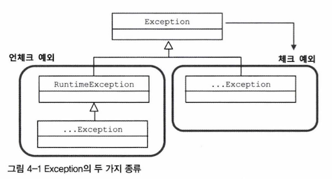

- 자바 개발자에게 예외처리란…쉽지않다….
- JdbcTemplate을 대표하는 스프링의 데이터 엑세스 기능에 담긴 예외처리와 관련된 접근 방법
- 예외를 처리하는 베스트 practice

# 4.1 사라진 SQLException

- `throws SQLException` 선언이 JdbcTemplate 적용 이후 사라짐

## 4.1.1 초난감 예외처리

- 안좋은 예외처리 예시
    1. 예외 블랙홀

        ```java
        try{
         // ...
        }
        catch(SQLException e){
        	// 예외를 잡고는 아무것도 하지 않음. 예외 발생을 무시해버리고 정상적인 상황인 것처럼
        	// 다음 라인으로 넘어가겠다는 분명한 의도가 있는 게 아니라면 연습 중에도 절대 만들어서는
        	// 안 되는 코드임
        }
        ```

        ```java
        try{
         // ...
        }
        catch(SQLException e){
        	e.printStackTrace(); // 로그를 띄워도 금방 묻히면 소용 없음
        }
        ```

    2. 무의미하고 무책임한 throws

        ```java
        public void method1() throws Exception {
        	method2();
        }
        public void method2() throws Exception{
        	method3();
        }
        public void method3() throws Exception{
        
        }
        ```


**⇒ 모든 예외는 적절하게 복구되든지 아니면 작업을 중단시키고 운영자 또는 개발자에게 분명하게 통보되어야함**

- 발생한 예외로 인해 어떤 기능이 비정상적으로 동작하거나, 메모리나 리소스가 소진되거나, 예상치 못한 다른 문제를 일으킬 것
- SQLException이 발생하는 이유
    - SQL 문법 에러
    - DB에서 처리할 수 없을 정도의 데이터 엑세스 로직의 버그
    - 서버가 죽거나 네트워크가 끊김
- 예외를 잡아서 뭔가 조치를 하지 않는다면 잡지 말아야함
- 차라리 메소드에 `throws SQLException`을 선언해서 메소드 밖으로 던지고 자신을 호출한 코드에 예외처리 책임을 전가하라

## 4.1.2 예외의 종류와 특징

- 예외를 어떻게 다뤄야 할까?
- 자바 `throws`를 통해 발생시킬 수 있는 예외
    1. Error
        - `java.lang.Error` 클래스의 서브클래스
        - 주로 JVM에서 발생시키는 것이고 애플리케이션 코드에서 잡으려 하면 안됨 (ex. `OutOfMemoryError`, `ThreadDeath`)
    2. Exception과 체크 예외
        - `java.lang.Exception` 클래스의 서브클래스

          

            - 체크 예외 : `RuntimeException` 클래스 상속 X
            - 언체크 예외 : `RuntimeException` 클래스 상속 O
        - 개발자들이 만든 애플리케이션 코드의 작업 중 예외상황 발생
        - 자바 언어와 JDK 초기 설계자들은 체크 예외를 발생 가능한 예외에 모두 적용하려했던 듯
    3. RuntimeException과 언체크/런타임 예외
        - 이 런타임 예외는 catch 문으로 잡거나 throws로 선언하지 않아도 됨
        - 프로그램의 오류가 있을 때 발생하도록 의도된 것
            - ex. 오브젝트를 할당하지 않은 레퍼런스 변수를 사용하려 했을 때 (`NullPointException`)
            - ex. 허용되지 않은 값을 사용해서 메소드를 호출할 때 (`IllegalArgumentException`)
        - 런타임 예외는 예상하지 못했던 예외상황에서 발생하는 게 아니기 때문에 굳이 catch나 throws를 사용하지 않아도 되도록 만든 것
- 체크 예외가 예외처리를 강제하는 것 때문에 예외 블랙홀이나 무책임한 throws 같은 코드가 남발됨
- 최근 자바 표준 스펙의 API들은 예상 가능한 예외상황을 다루는 예외를 체크 예외로 만들지 않는 경향이 있기도 함

## 4.1.3 예외처리 방법

1. 예외 복구
    - 예외상황을 파악하고 문제를 해결해서 정상 상태로 돌려놓음
    - 다른 작업 흐름으로 자연스럽게 유도함
        - ex. 사용자가 요청한 파일이 없어서 IOExcetion이 발생함 → 다른 파일을 사용하도록 함
        - ex. 원격 DB 서버에 접속하다가 실패해서 SQLException이 발생함 → 재시도
    - 예외가 처리됐으면 비록 기능적으론 사용자에게 예외상황으로 비쳐도 애플리케이션에서는 정상적으로 설계된 흐름을 따라 진행되어야함
    - 예외처리 코드를 강제하는 체크 예외들은 이렇게 예외를 어떤 식으로든 복구할 가능성이 있는 경우에 사용함
2. 예외처리 회피
    - 예외처리를 자신이 담당하지 않고 자신을 호출한 쪽으로 던져버리는 것
    - throws 문으로 선언해서 예외가 발생하면 알아서 던져지게 하거나 catch문으로 일단 예외를 잡은 후에 로그를 남기도 다시 예외를 던지는(throws) 것

    ```java
    public void add() throws SQLException{
    	try{
    		// JDBC API
    	}
    	cathch(SQLException e){
    		// 로그 출력
    		throws e;
    	}
    }
    ```

    - 콜백과 템플릿처럼 긴밀하게 역할을 분담하고 있는 관계가 아니라면 자신의 코드에서 발생하는 예외를 구냥 던져버리는 건 무책임한 책임회피일 수 있음 → 의도가 분명해야함
3. 예외 전환
    - 발생한 예외를 그대로 넘기는 게 아니라 적절한 예외로 전환해서 던진다
    - 목적
        - 내부에서 발생한 예외를 그대로 던지는 것이 그 예외상황에 대한 적절한 의미를 부여해주지 못하는 경우에, 의미를 분명하게 해줄 수 있는 예외로 바꿔주기 위해
            - ex. `SQLException` → `DuplicateUserIdException`

    ```java
    public void add(User user) throws DuplicateUserIdException, SQLException {
    	try {
    		// SQLException을 던지는 메소드 호출
    	} catch (SQLException e) {
    		if (e.getErrorCode() == MysqlErrorNumbers.ER_DUP_ENTRY) 
    			throw DuplicateUserIdException(); // 예외 전환해서 던짐
    		else
    			throw e; // 그 외의 경우는 SQLException 그대로
    	}
    }
    ```

    - 중첩 예외 (nested exception)로 만드는 것이 좋음
        - `throw DuplicateUserIdException(e);`
        - `throw DuplicateUserIdException().initCause(e);`
    - 복구가 불가능한 예외라면 가능한 빨리 런타임 예외로 포장해 던지게 해서 다른 계층의 메소들르 작성할 때 불필요한 throws 선언이 들어가지 않도록 해야함

## 4.1.4 예외처리 전략

- 효과적이고 깔끔한 예외

### 런타임 예외의 보편화

> 체크 예외는 일반적인 예외를 다루고, 언체크 예외는 시스템 장애나 프로그램상의 오류에 사용함
>
- JE환경에서는 하나의 요청을 처리하는 중에 예외가 발생하면 해당 작업만 중단시키면 됨
- 애플리케이션 차원에서 예외상황을 미리 파악하고, 예외가 발생하지 않도록 차단하는 게 좋음
- 항상 복구 가능한 예외가 아니라면 일단 언체크 예외로 만들지만, 대게 복구가 불가능한 상황이고 보나마나 `RuntimeException` 등으로 포장해서 던져야 할 테니 아예 API 차원에서 런타임 예외를 던지도록 하는 것

### add() 메소드의 예외처리

> 💡**낙관적인 예외처리 기법**
>- 복구할 수 있는 예외는 없다 가정
>- 예외가 생겨도 어차피 런타임 예외이므로 시스템 레벨에서 처리
>- 꼭 필요한 경우는 런타임 예외라도 잡아서 복구하거나 대응해줄 수 있으니 문제 없음!
>
- `SQLException`은 대부분 복구 불가능한 예외이므로 잡아봤자 처리할 것도 없고 결국 throws를 타고 전달되다가 애플리케이션 밖으로 던져짐
- 어디서든 잡아서 처리할 수 있는 exception이라면 굳이 체크 예외로 만들지 않고 런타임 예외로 만드는 것이 낫다

```java
public class DuplicateUserIdException extends RuntimeException {
	// NestedException를 만들기 위해 생성자 추가
	public DuplicateUserIdException(Throwable cause) { 
		super(cause);
	}
}
```

```java
public void add(User user) throws DuplicateUserIdException{
	try {
		// SQLException을 던지는 메소드 호출
	} catch (SQLException e) {
		if (e.getErrorCode() == MysqlErrorNumbers.ER_DUP_ENTRY) 
			throw new DuplicateUserIdException(e); // 예외 전환
		else
			throw new RuntimeException(e); // 예외 wrap (CheckedException -> UncheckedException)
	}
}
```

- 런타임 예외를 일반화해서 사용하면 여러 장점이 많지만 컴파일러가 예외처리를 강제하지 않으므로 신경 쓰지 않으면 예외상황을 충분히 고려하지 않을 수 있음

### 애플리케이션 예외

> 💡**비관적 접근방법**
>- 직접 처리할 수 없는 예외가 대부분이어도 혹시 놓치는 예외가 있을 수 있으니 일단 잡고 보도록 강제함
>
- 애플리케이션 예외
    - 시스템 또는 외부의 예외상황이 원인이 아니라 애플리케이션 자체의 로직에 의해서 발생
    - 반드시 catch해서 무언가 조치를 취하도록 요구함
- 리턴값으로 결과를 확인하고 예외상황 체크 시, 불편한 점
    1. 예외상황에 대한 리턴 값을 명확하게 코드화하고 잘 관리하지 않으면 혼란이 생길 수 있음
    2. 정상적인 흐름을 따르는 코드는 그대로 두고, 예외 상황에서는 비즈니스적인 의미를 띤 예외를 던지도록 함
- 정상 흐름을 다 try 안에 넣고 예외상황에 대한 처리는 catch 블록에서 수행
- 이때 사용하는 예외는 의도적으로 체크 예외로 만든다

```java
try{
	BigDecimal balance = account.withdraw(amount);
	// 정상적인 처리 결과를 출력하도록 진행
}
catch(InsufficientBalanceException e){ // 체크 예외
	// InsufficientBalanceException에 담긴 인출 가능한 잔고금액 정보를 가져옴
	BigDecimal availFunds = e.getAvailFunds();
	// 잔고 부족 안내 메시지를 준비하고 이를 출력하도록 진행
}
```

## 4.1.5 SQLException은 어떻게 됐나?

- `SQLException`은 복구 가능한 예외인가? → 99%의 확률로 NO
    - 시스템 예외라면 애플리케이션 레벨에서 복구 불가능
- `JdbcTemplate` 템플릿과 콜백 안에서 발생하는 모든 `SQLException`을 런타임 예외인 `DataAccessException`으로 포장해서 던져줌
- `JdbcTemplate`을 사용하는 `UseDao` 메소드에서는 꼭 필요한 경우에만 런타임 예외인 `DataAccessException`을 잡아서 처리하면 되고 그 외의 경우는 무시해도 됨
- 스프링의 API 메소드에 정의되어 있는 대부분의 예외는 런타임 예외이므로 발생 가능한 예외가 있다고 하더라도 이를 처리하도록 강제하지 않음
