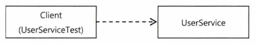

> **💡 스프링 3대 기술**
>- IoC / DI (의존성 역전)
>- 서비스 추상화
>- AOP

[서비스 추상화](https://yangbongsoo.gitbook.io/study/spring-1/service_abstraction)

- AOP의 등장 배경, 스프링이 도입한 이유, 적용을 통해 얻을 수 있는 이점
- AOP의 가치와 효과적으로 사용할 방법
- AOP의 네임드 적용 대상 : 선언적 트랜잭션 기능
    - 서비스 추상화를 통해 많은 근본적인 문제를 해결한 트랜잭션 경계 설정 기능

# 6.1 트랜잭션 코드의 분리

- 트랜잭션의 경계는 비즈니스 로직의 전후에 설정되어야함. UserService에서 걷어내고 싶다!

## 6.1.1 메소드 분리

```java
public void upgradeLevels() throws Exception {
	 // 트랜잭션 경계 설정
	TransactionStatus status = this.transactionManager.getTransaction(new DefaultTransactionDefinition());
	
	try {

		//비즈니스 로직 코드
		List<User> users = userDao.getAll();
		for (User user: users) {
			if (canUpgradeLevel(user)) {
				upgradeLevel(user);
			}
		}

		// 트랜잭션 경계 설정
		this.transactionManager.commit(status); 
	} catch (Exception e) {
			 // 트랜잭션 경계 설정
			this.transactionManager.rollback(status);
			throw e;
	}
}
```

- 얽힌 것 처럼 보이지만 트랜잭션 경계 설정 코드와 비즈니스 로직 코드로 구분할 수 있음
- 트랜잭션 경계 설정의 코드와 비즈니스 로직 코드 간에 서로 주고받는 정보가 없음
    - 비즈니스 로직에서 DB 커넥션 정보를 직접 볼 일은 없음
    - 트랜잭션 정보는 DAO가 알아서 활용함

⇒ 둘은 완전히 독립적인 코드이다! ⇒ 분리할까?!

```java
// 트랜잭션 경계 설정
public void upgradeLevels() throws Exception {	 
	TransactionStatus status = this.transactionManager.getTransaction(new DefaultTransactionDefinition());
	
	try {
		upgradeLevelsInternal();
		this.transactionManager.commit(status); 
	} catch (Exception e) {
			this.transactionManager.rollback(status);
			throw e;
	}
}

// 분리된 비즈니스 로직 코드, 트랜잭션을 적용하기 전과 동일함
private void upgradeLevelsInternal(){
	//비즈니스 로직 코드
	List<User> users = userDao.getAll();
	for (User user: users) {
		if (canUpgradeLevel(user)) {
			upgradeLevel(user);
		}
	}
}
```

## 6.1.2 DI를 이용한 클래스의 분리

- 그래도 아직 `UserService`에 트랜잭션 관련 코드가 있다. 적어도 이 클래스 안에서는 뺄 수 있지 않을까?

### DI 적용을 이용한 트랜잭션 분리

- 직접 사용하는 것이 문제라면 간접적으로 사용하면 됨! → *DI*
- 실제로 사용할 오브젝트의 클래스 정체는 감춘 채 인터페이스를 통해 간접으로 접근함

< Before >



< After >


- 구현 클래스를 바꾸기 위해 DI를 적용하여 사용함
- 한 번에 두 개의 UserService 인터페이스 구현체를 이용한다면????

  

    - 트랜잭션 경계 설정 책임을 위한 구현체를 하나 더 만든다
    - 트랜잭션 경계 설정 → 실질적인 비즈니스 처리 위임 호출 → 트랜잭션 경계 설정
    - 트랜잭션까지 적용된 비즈니스 로직의 구현

### UserService 인터페이스 도입

- 로직은 Impl에서 구현하고 `UserService`는 인터페이스로 만듦

```java
public interface UserService {
	void add(User user);
	void upgradeLevels();
}
```

```java
// 트랜잭션 코드를 제거한 UserService 구현 클래스
public class UserServiceImpl implements UserService {
	UserDao userDao;
	MailSender mailSender;

	public void upgradeLevels() {
		List<User> users = userDao.getAll();
		for (User user: users) {
			if (canUpgradeLevel(user)) {
				upgradeLevel(user);
			}
		}
	}
	...
}
```

### 분리된 트랜잭션 기능

```java
// 트랜잭션이 적용된 UserServiceTx
public class UserServiceTx implements UserService {
	UserService userService;
	PlatformTransactionManager transactionManager;
	
	public void setTransactionManager(PlatformTransactionManager transactionManager) {
		this.transactionManager = transactionManager;
	}

	// UserService를 구현한 다른 오브젝트를 DI 받음
	public void setUserService(UserService userService) {
		this.userService = userService;
	}

	// DI 받은 UserService 오브젝트에 모든 기능을 위임
	public void add(User user) {
		this.userService.add(user);
	}

	// DI 받은 UserService 오브젝트에 모든 기능을 위임
	public void upgradeLevels() {
		TransactionStatus status = this.transactionManager.getTransaction(new DefaultTransactionDefinition());
		try {
			this.userService.upgradeLevels();
			this.transactionManager.commit(status);
		} catch (RuntimeException e) {
				this.transactionManager.rollback(status);
				throw e;
		}	
	}
}
```

- 기본적으로 `UserSerivce`를 구현함
- 같은 인터페이스를 구현한 다른 오브젝트에게 고스란히 작업을 위임
- transactionManager : 추상화된 트랜잭션 구현 오브젝트를 DI 받을 수 있음

### 트랜잭션 적용을 위한 DI 설정

- 설정파일 수정


- `UserServiceTx` - `transactionManager`
- `UserServiceImpl` - `userDao,` `mailSender`


### 트랜잭션 분리에 따른 테스트 수정

- 기존의 UserService 클래스가 인터페이스와 두 개의 클래스(`UserServiceTx`, `UserServiceImpl`)로 분리됨
    - 기존의 빈은 `@Autowired`로 DI 해결
    - `@Autowired` 는 기본적으로 타입이 일치하는 빈을 찾아주기에 문제가 발생함 (인터페이스 구현체가 2개라)
    - 타입이 안맞으면 필드 명을 이용해 빈을 찾음
- 목 오브젝트를 이용해 수동 DI를 적용하는 테스트라면, 어떤 클래스의 오브젝트인지 분명하게 알 필요가 있음
- 해당 클래스로 만들어진 빈을 주입받도록 해야함

```java
@Test
public void upgradeAllOrNothing() throws Exception {
	TestUSerService testUserSerivce = new TestUserService(users.get(3).getId());
	testUserSerivce.setUserDao(userDao);
	testUserSerivce.setMailSender(mailSender);
	
	UserServiceTx txUserService = new USerServiceTx();
	txUserService.setTransactionManager(transactionManager);
	txUSerService.setUserService(testUserService);

	userDao.deleteAll();
	for(User user : users) userDao.add(user);
	try{
		txUserService.upgradeLevels();
		fail("TestServiceException expecte");
	}
	...
		
}
```

### 트랜잭션 경계설정 코드 분리의 장점

1. 비즈니스 로직은 담당하는 `UserServiceImpl`의 코드를 작성할 때 트랜잭션과 같은 기술적인 내용은 신경쓰지 않아도 됨
2. 비즈니스 로직에 대한 테스트를 손쉽게 만들 수 있음
