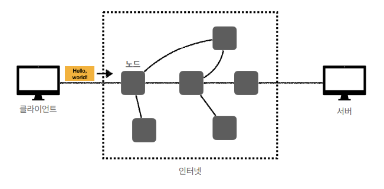

# 인터넷 네트워크

## 인터넷 통신

- 메시지를 전달해야하는 pc가 멀리 있으면 인터넷 망을 통함
- 어떤 규칙으로 메시지가 목적지까지 안전하게 도달할까?

## IP(인터넷 프로토콜)

- 최소한의 규칙
- 지정한 IP주소에 데이터 전달
- 패킷(packet)이라는 통신 단위로 데이터 전달
- 요청과 응답이 서로 다른 곳으로 될 수도 있음

### IP 프로토콜의 한계

1. 비연결성
    1. 패킷 받을 대상이 없거나 서비스 불능이어도 패킷 전송
2. 비신뢰성
    1. 중간에 패킷이 사라진다? 순서보장?
    2. 메시지가 1500byte정도 넘으면 끊어서 보냄
3. 프로그램 구분
    1. 같은 IP를 사용하는 서버에서 통신하는 애플리케이션이 둘 이상이면?

**⇒ 이 문제를 해결해 주는 것이 TCP, UDP**

# TCP, UDP

### 인터넷 프로토콜 스택의 4계층

- IP 위에  TCP를 얹어서 보완함

### 프로토콜 계층

- 애플리케이션 > 운영체제 > 실제 네트워크 장비
- HTTP(socket 라이브러리) > TCP > IP 관련 정보를 순차적으로 씌움
- 이더넷까지는 너무 딥함

### 패킷 = 패키지 + 버킷

- IP 패킷 정보
    - 출발지 IP, 목적지 IP
- TCP/IP 패킷 정보
    - 출발지 Port, 목적지 Port
    - 전송 제어, 순서, 검증 정보 …

### TCP 특징

> 전송 제어 프로토콜 (Transmission Control Protocol)
>
1. 연결지향
    1. 상대가 꺼져있으면 안되니까 그걸 확인하고 보냄
    2. TCP 3 way handshake (가상연결)
2. 데이터 전달 보증
3. 순서보장

**⇒ 신뢰할 수 있는 프로토콜이며 현재 대부분 TCP 활용**

### TCP 3 way handshake

- 클라이언트도 보내고 서버도 보내서 서로가 서로를 믿을 수 있음 → 우리가 연결이 되었구나!
- 연결이 되고 나면 그 다음에 데이터 전송, 연결 안되면 메시지를 안보냄
- 요즘은 최적화가 되어서 3.ACK를 보낼 때 4.데이터 전송도 같이 함
- 중간에 수 많은 노드를 거치기때문에 논리적으로 연결이 된거지 물리적인 연결은 아니다

### 순서 보장

- 전송제어 정보를 TCP 안에 보내기 때문에 가능함

### UDP 특징

> 사용자 데이터그램 프로토콜(User Datagram Protocol)
>
1. 연결지향 ❌
2. 데이터 전달 보증❌
3. 순서 보장❌
- 더 최적화 하고 싶다면? TCP는 그냥 쓰고 UDP는 하얀 도화지 같은 거라서 UDP를 최적화하면 됨
- 데이터 전달 및 순서가 보장되지 않지만, 단순하고 빠름
- IP와 거의 같고 PORT, 체크썸 정도만 추가
    - PORT : 하나의 IP에서 여러 애플리케이션 돌릴 때

# PORT

- IP는 목적지를 찾는거고 그 목적지 서버 안에서도 어떤 애플리케이션인지
- 패킷에는 따라서 아래와 같이 정보가 들어감
    - 출발지 IP, PORT
    - 목적지 IP, PORT
- IP는 아파트, PORT는 몇동 몇호
- 대표적인 포트
    - FTP - 20,21
    - TELNET - 23
    - HTTP - 80
    - HTTPS - 443

# DNS

도메인 네임 시스템 (Domain Name System)

- IP는 기억하기 어렵고 변경될 수 있다
- 도메인 명을 IP 주소로 변환

