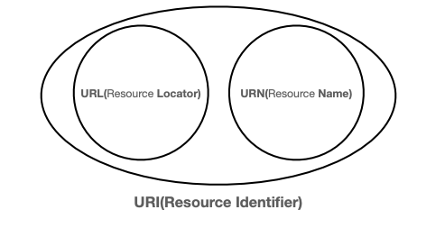

# URI와 웹 브라우저 요청 흐름

## URI

> Uniform Resource Identifier
>
- Uniform : 리소스 식별하는 통일된 방식
- Resource : 자원, URI로 식별할 수 있는 모든 것(제한 없음)
- Identifier : 다른 항목과 구분하는데 필요한 정보

- 로케이터(locator), 이름(name) 또는 둘 다 추가로 분류될 수 있음
    - URL - Locator : 리소스가 있는 위치를 지정
    - URN - Name : 리소스에 이름을 부여

- 거의 URL을 쓰고 URN은 그런게 있다 정도만 알면 됨
- 위치는 변할 수 있지만, 이름은 변하지 않는다
- URN 이름만으로 실제 리소스를 찾을 수 있는 방법이 보편화 되지 않음

### URL 분석

> https://www.google.com/search?q=hello&hl=ko
>

> scheme://[userinfo@]host[:port][/path][?query][#fragment]
>
- 스키마
    - 주로 프로토콜 (https)
        - 프로토콜 : 어떤 방식으로 자원에 접근할 것인가 하는 약속 규칙
    - https(port 443), http(port 80)은 생략 가능
    - https는 http에 강력한 보안 추가
- userinfo
    - 사용자 정보 인증
    - 거의 사용하지 않음
- 호스트명 (www.google.com)
    - 도메인 명 또는 IP주소 직접 입력
- 포트번호 (443)
    - 생략시 http는 80, https는 443
- 패스 (/search)
    - 계층 구조
- 쿼리 파라미터 (q=hello&hl=ko)
    - key=value 구조
    - ?로 시작하고 &로 추가 가능
    - query parameter, query string 등으로 불림
    - 웹서버에 제공하는 문자 형태의 파라미터
- fragment

  > [https://docs.spring.io/spring-boot/docs/current/reference/html/getting-started.html#getting-started.introducing-spring-boot](https://docs.spring.io/spring-boot/docs/current/reference/html/getting-started.html#getting-started.introducing-spring-boot)
  >
    - html 내부 북마크 등에 사용
    - 서버로 전송되는 정보는 아님

# 웹 브라우저 요청 흐름

1. DNS 서버 조회
2. HTTP 요청 메시지 생성
    1. IP, Port

   

3. HTTP 메시지 전송

   

    1. 패킷 생성
    - 전송 데이터에 HTTP 메시지 포함

   

    1. 서버가 받으면 IP패킷을 버리고 HTTP 메시지를 해석함
    2. 서버가 HTTP 응답 메시지 return

       