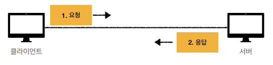

# HTTP 기본

## 모든 것이 HTTP

> HyperText Transfer Protocol
>
- 대부분 HTTP 프로토콜로 데이터 전송 (직접 TCP로 붙어 개발하는 경우는 거의 없음)
- HTTP 1.1 1997년 : 가장 많이 사용, 우리에게 가장 중요한 버전

### 기반 프로토콜

- TCP - HTTP/1.1, HTTP/2
- UDP - HTTP/3

### HTTP 특징

- 클라이언트 서버 구조
- 무상태 프로토콜(스테이스리스), 비연결성
- HTTP 메시지
- 단순함, 확장 가능

## 클라이언트 서버 구조

- 클라이언트가 HTTP 메시지(request)를 보내면 서버가 응답을 하고 서버의 응답이 올 때까지 기다린다
- 예전에는 클라이언트와 서버라는 개념이 분리되어있지 않았음
- 비즈니스 로직, 데이터는 서버에 밀어넣고 클라이언트는 UI나 사용성에 집중함

# Stateful, Stateless

무상태 프로토콜

- 서버가 클라이언트의 상태를 보존하지 않음

### Stateful vs Stateless

- 상태 유지
    - 노트북 → 2개 → 신용카드
    - 중간에 다른 점원으로 바뀌면 안된다

  

- 무상태
    - 노트북 → 노트북 2개 → 노트북 2개 신용카드
    - 중간에 점원이 바뀌어도 된다
    - 무상태는 갑자기 고객이 증가해도 점원을 대거 투입 가능

  

⇒ 무상태는 갑자기 클라이언트 요청이 증가해도 서버를 대거 투입할 수 있다

⇒ 무상태는 응답 서버를 쉽게 바꿀 수 있다

**⇒ 무한한 서버 증설 가능 (스케일 아웃 - 수평 확장 유리)**

### Stateless의 한계

- 무상태로 설계 불가한 경우도 있음
    - ex. 로그인
        - 로그인한 사용자의 경우 로그인 했다는 상태를 서버에 유지
        - 일반적으로 브라우저 쿠키와 서버 세션등을 사용해서 상태 유지
- 데이터를 너무 많이 보냄

**⇒ 상태 유지는 최소한만 사용**

## 비 연결성(connectionless)

- 연결을 유지하는 모델
    - 클라이언트2랑 3이 놀고있어도 계속 서버를 유지해야함

  

- 연결을 유지하지 않는 모델
    - 자원의 사용을 최소한으로 하면서 서버를 유지할 수 있음
    - 요청할 때 다시 연결함

  

- HTTP는 기본이 연결을 유지하지 않는 모델
- 1시간 동안 수천명이 서비스를 사용해도 실제 서버에서 동시에 처리하는 요청은 수십개 이하로 매우 적음
    - ex. 브라우저에서 계속 연속해서 검색 버튼을 누루지 않는다
- 서버 자원을 매우 효율적으로 사용할 수 있음 (가용성⬆️)

### 비 연결성 한계

- TCP/IP 연결을 새로 맺어야함 - 3 way handshake 시간 추가
- 웹 브라우저로 사이트를 요청하면 HTML뿐 아니라 js, css, img 등 수 많은 자원이 함께 다운로드
- 지금은 HTTP 지속 연결(Persistent Connections)로 문제 해결

**HTTP 초기 - 연결, 종료 낭비**

**HTTP 지속 연결 (Persistent Connections)**

- HTTP/2, HTTP/3에서 더 많은 최적화가 됨

### Stateless를 기억하자

- 서버 개발자들이 어려워하는 업무
- ex. 티켓팅, 수강신청, 이벤트 → 수만명이 동시에 요청
- 그래도 최대한 무상태로 설계해서 서버를 확 늘려서 대응해야함
- 정적 페이지에서 뭘 보다가 누르도록 최대한 유도해야함

## HTTP 메시지

- 우리가 생각하는 모든 binary 데이터를 HTTP로 보낼 수 있다
- 요청 메시지와 응답 메시지가 약간 다르게 생겼다
    - 공백 라인은 무조건 있어야함

### 시작 라인

- request-line : 요청 메시지
    - **method** : HTTP 메서드 (`GET`, `PUT`, `POST`, `DELETE`)
        - 서버가 해야할 동작 지정
        - `GET` : 리소스 조회, `POST` : 요청 내역 처리
    - SP(공백)
    - **request-target** : 요청대상 (/search?q=hello?hl=ko)
        - 절대경로[?쿼리]
        - 절대경로 = ”/”로 시작하는 경로
        - 다른 유형의 경로지정 방법도 있음
    - SP(공백)
    - **HTTP-version**
    - CRLF(엔터)
- status-line : 응답 메시지
    - **HTTP-version**
    - SP(공백)
    - **status-code** : HTTP 상태코드 (요청 성공, 실패를 나타냄)
        - 200 : 성공
        - 400 : 클라이언트 요청 오류
        - 500 : 서버 내부 오류
    - SP(공백)
    - **reason-phrase** : 상태코드를 설명하는 사람이 읽을 수 있는 글
    - CRLF(엔터)

### HTTP 헤더

- HTTP 전송에 필요한 모든 부가정보
- ex. 메세지 바디의 내용, 메시지 바디의 크기, 압축, 인증, 요청 클라이언트(브라우저)정보, 서버 애플리케이션 정보, 캐시 관리 정보…

- header-field = field-name “:” OWS filed-value OWS (OWS:띄어쓰기 허용)
- filed-name은 대소문자 구분 없음

### HTTP 메시지 바디

- 실제 전송할 데이터
- HTML 문서, 이미지, 영상, JSON 등등 byte로 표현할 수 있는 모든 데이터 전송 가능

### 단순함 확장 가능

- 첫줄-머리-몸 엄청 복잡한 구조는 아니다
- 단순하지만 확장 가능한 기술이 크게 성공하는 것 같다

**⇒ 지금은 HTTP 시대**