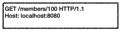

# HTTP 메서드

## HTTP API를 만들어보자

가장 중요한 것은 **리소스 식별**

### API URI 고민

- 리소스의 의미는 뭘까?
    - 회원 등록, 조회, 수정에서는 회원이라는 개념 자체가 리소스!
- 리소스를 어떻게 식별할까?
    - 등록, 수정, 조회는 모두 배제
    - 회원이라는 리소스만 식별하면 된다 → 회원 리소스를 URI에 매핑

> 💡**같은 리소스에 대한 행위라면?**
>- 회원 목록 조회 `/members`
>- 회원 조회 `/members/{id}`
>- 회원 등록 `/members/{id}`
>- 회원 수정 `/members/{id}`
>- 회원 삭제 `/members/{id}`  
>  ⇒ 어떻게 구분하지…?
>

### 리소스와 행위를 분리

- 가장 중요한 것은 리소스를 식별하는 것
- URI는 리소스만 식별!
- 리소스와 해당 리소스를 대상으로 하는 행위를 분리
    - 리소스 : 회원 **→ 명사**
    - 행위 : 조회, 등록, 삭제, 변경 **→ 동사**

## **HTTP 메서드 - GET, PO**ST

- GET : 리소스 조회 - `READ`
- POST : 요청 데이터 처리, 주로 등록에 사용 - `CREATE`, `READ`, `UPDATE`
- PUT : 리소스를 대체, 해당 리소스가 없으면 생성 - `UPDATE`
- PATCH : 리소스 부분 변경
- DELETE : 리소스 삭제- `DELETE`
- HEAD : GET과 동일하지만 메시지 부분을 제외하고, 상태 줄과 헤더만 반환
- OPTIONS : 대상 리소스에 대한 통신 가능 옵션(메소드)을 설명 (주로 CORS에서 사용)

### GET

```
GET/search?1=hello&hl=ko HTTP/1.1
HOST: www.google.com
```

- 리소스 조회
- 서버에 전달하고 싶은 데이터는 query(쿼리 파라미터, 쿼리 스트링)를 통해서 전달
- 메시지 바디를 사용해서 데이터를 전달할 수 있지만, 지원하지 않는 곳이 많아서 권장하지 않음




### POST

- 요청 데이터 처리
- 메시지 바디를 통해 서버로 요청 데이터 전달
- 서버는 요청 데이터를 처리
    - 메시지 바디를 통해 들어온 데이터를 처리하는 모든 기능을 수행함
- 주로 전달된 데이터로 신규 리소스 등록, 프로세스 처리에 사용


- POST 메서드는 대상 리소스가 리소스의 고유한 의미 체계에 따라 요청에 따라 요청에 포함된 표현을 처리하도록 요청합니다
- 게시판, 뉴스, 그룹, 메일링 리스트 등 그룹에 메시지 게시
- 서버가 아직 식별하지 않은 새 리소스 생성
- 기존 자원에 데이터 추가

**⇒ URI에 POST 요청이 오면 요청 데이터를 어떻게 처리할지 리소스마다 따로 정해야함**

⇒ **정해진 것이 없음**

### POST 정리

1. 새 리소스 생성(등록)
2. 요청 데이터 처리
    1. 단순 값 생성, 변경이 아닌 프로세스를 처리해야하는 경우
    2. POST의 결과로 새로운 리소스가 생성되지 않을 수 있음

       컨트롤 URI

        ```
        POST /orders/{orderId}/start-delivery
        ```

3. 다른 메서드로 처리하기 애매한 경우
    1. ex) JSON으로 조회 데이터를 넘겨야하는데, GET 메서드를 사용하기 어려운 경우
    2. 애매하면 POST
- GET으로 오면 캐싱이 되는데 POST는 캐싱을 안함
- 조회는 왠만하면 GET

## HTTP 메서드 - PUT, PATCH, DELETE

### PUT

- 리소스를 **완전히 대체 (수정이 아니다!)**
    - 폴더에 파일 복사하는 것과 비슷함 (없으면 생기고, 기존에 있었으면 덮어씀)

  

  

- ⭐ 클라이언트가 리소스를 식별
    - 클라이언트가 리소스 위치를 알고 URI 지정
    - POST와 차이점

### PATCH

- 리소스 부분 변경
- 요즘은 거의 다 될텐데 지원이 안되는 서버도 있음


### DELETE

- 리소스 제거

# HTTP 메서드의 속성


### 안전(Safe Methods)

- 호출해도 리소스가 변하지 않는다
- 해당 리소스만 고려하기에 로그가 쌓여서 장애 발생 이런 경우의 수는 고려하지 않는다

### 멱등(Idempotent Methods)

- 한 번 호출하든 두 번 호출하든 100번 호출하든 결과가 같다
- 메소드별 멱등 여부
    - GET ⭕
    - PUT ⭕
    - DELETE ⭕
    - POST ❌  : 결제 두 번..?
- 자동 복구 메커니즘
    - 같은 요청을 두 번 해도 괜찮은가?의 판단 근거
- 외부 요인으로 인해 중간에 리소스가 변경되는 것까지는 멱등 여부에 고려하지 않는다

### 캐시가능(Cacheable Methods)

- 응답 결과를 캐시해서 사용할 수 있는가?
- 큰 요청을 보낼 때 웹 브라우저가 내부에 리소스를 저장할 수 있는가?
- 메소드별 캐시 여부
    - GET, HEAD, POST, PATCH ⭕
    - 실제로는 GET, HEAD 정도만 사용
- 캐시하려면 캐시 key가 맞아야하는데 POST, PATCH는 본문 내용까지 캐시 key로 고려해야해서 너무 복잡함