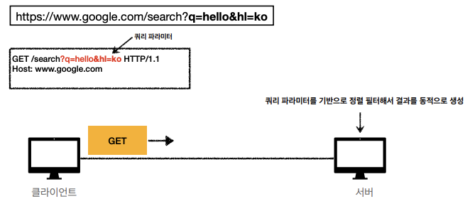

# HTTP 메서드 활용

## 클라이언트에서 서버로 데이터 전송

### 데이터를 전달 하는 방식은 크게 2가지

1. 쿼리 파라미터를 통한 데이터 전송
    1. GET
    2. 주로 정렬 필터(검색어)
2. 메시지 바디를 통한 데이터 전송
    1. POST, PUT, PATCH
    2. 회원가입, 상품주문, 리소스 등록, 리소스 변경

### 클라이언트에서 서버로 데이터 전송하는 4가지 상황

1. 정적 데이터 조회
    - 조회는 GET 사용
    - 정적 데이터는 일반적으로 쿼리 파라미터 없이 리소스 경로로 단순하게 조회 가능
2. 동적 데이터 조회

   

    - 조회는 GET 사용 (쿼리 파라미터를 통해 데이터 전달)
    - 주로 검색, 게시판 목록에서 정렬 필터 (검색어)
    - 조회 조건을 줄여주는 필터, 조회 결과를 정렬하는 정렬 조건에 주로 사용
3. HTML Form을 통한 데이터 전송

   > 💡HTML Form 전송은 `GET`, `POST`만 지원
   >
    1. POST 전송 - 저장

       

        - `Content-Type: application/x-www-form—urlencoded`
            - form의 내용을 메시지의 바디를 통해서 전송 (key=value, 쿼리 파라미터 형식)
            - 전송 데이터를 url encoding 처리
    2. GET 전송 - 저장

       

    3. multipart/form-data

       

        - `Content-Type: multipart/form-data`
            - 주로 파일 업로드 같은 바이너리 데이터를 전송할 때 사용
        - 다른 종류의 여러 파일과 폼의 내용을 함께 전송 가능 (그래서 이름이 multipart)
4. HTTP API를 통한 데이터 전송

   

    - 서버끼리 통신할 때 많이 사용
    - 웹 클라이언트
        - HTML에서 Form 전송 대신 자바스크립트를 통해 통신에 사용 (AJAX)
    - `POST`, `PUT`, `PATCH` : 메시지 바디를 통해 데이터 전송
    - `GET` : 조회, 쿼리 파라미터로 데이터 전달
    - `Content-Type: application/json`을 주로 사용 (사실상 표준)

## HTTP API 설계 예시

### HTTP API - 컬렉션 (POST 기반 등록)

- 리소스를 식별해야지 다른걸 식별하면 안된다

```
회원 목록 조회 /members → GET
회원 조회 `/members/{id}` → GET
회원 등록 `/members/{id}` → POST
회원 수정 `/members/{id}` → PATCH, PUT, POST
회원 삭제 `/members/{id}` → DELETE
```

- **클라이언트는 등록될 리소스의 URI를 모른다**
    - POST `/members`
- POST에서는 신규 등록한 다음에 서버가 새로 등록된 리소스 URI를 생성해준다
    - `Location: /members/100`
- 컬렉션(Collection)
    - 서버가 관리하는 리소스 디렉토리
    - 서버가 리소스의 URI를 생성하고 관리
    - 여기서 컬렉션은 `/members`

### HTTP API - 스토어 (PUT 기반 등록)

```
파일 목록 /files → GET
파일 조회 `/files/{filename}` → GET
파일 등록 `/files/{filename}` → PUT
파일 삭제 `/files/{filename}` → DELETE
파일 대량 등록 `/files` → POST
```

- POST의 의미를 새로 지정해도 됨
- 클라이언트가 리소스의 URI를 알고있어야함
    - PUT `files/star.jpg`
- 클라이언트가 직접 리소스의 URI를 지정함
- 스토어(Store)
    - 클라이언트가 관리하는 리소스 저장소
    - 클라이언트가 리소스의 URI를 알고 관리
    - 여기서 스토어는 `/files`

> 💡**POST vs PUT**  
> POST - 서버가 리소스 알아서 만듦 클라이언트는 모름  
> PUT - 리소스 URI를 알고 등록해서 클라이언트가 알고 URI를 직접 관리함
>

### HTML FORM 사용 (GET, POST만 지원)

- HTML FORM은 GET, POST만 지원
    - 제약이 있음
- AJAX 같은 기술을 사용해서 해결 가능

```
회원 목록 /members -> **GET**
회원 등록 폼 /members/new -> **GET**
회원 등록 /members/new, /members -> **POST**
회원 조회 /members/{id} -> **GET**
회원 수정 폼 /members/{id}/edit -> **GET**
회원 수정 /members/{id}/edit, /members/{id} -> **POST**
회원 삭제 /members/{id}/delete -> **POST**
```

- 컨트롤 URI
    - GET, POST만 지원하므로 제약이 있음
    - 이런 제약을 해결하기 위해 동사로 된 리소스 경로 사용
    - POST의 /new, /edit, /delete가 컨트롤 URI
    - HTTP 메서드로 해결하기 애매한 경우 사용 (HTTP API 포함)

### 참고하면 좋은 URI 설계 개념

- 문서 (document)
    - 단일 개념(파일 하나, 객체 인스턴스, 데이터베이스 row)
    - ex) `/members/100`, `/files/star.jpg`
- 컬렉션 (collection)
    - 서버가 관리하는 리소스 디렉토리
    - 서버가 리소스의 URI를 생성하고 관리
    - ex) `/members`
- 스토어 (store)
    - 클라이언트가 관리하는 자원 저장소
    - 클라이언트가 리소스의 URI를 알고 관리
    - ex) `/files`
- 컨트롤러(controller), 컨트롤 URI
    - 문서, 컬렉션, 스토어로 해결하기 어려운 추가 프로세스 실행
    - 동사를 직접 사용
    - ex) `/members/{id}/delete`