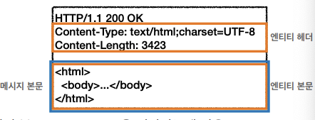

# HTTP 헤더 개요

- HTTP 전송에 필요한 모든 부가정보
- RFC2616 (과거)
    - General 헤더 : 메시지 전체에 적용되는 정보
    - Request 헤더
    - Response 헤더
    - Entity 헤더 : 엔티티 바디 정보 (컨텐트 타입, 길이 등등)

  

    - message body : 엔티티 본문 전달
    - 엔티티 헤더 : 엔티티 본문의 데이터를 해석할 수 있는 정보 제공
- 근데 개정되는 과정에서 엔티티라는 용어가 사라지고 표현이라는 용어가 들어옴
    - RFC723X
    - 표현 = 표현 메타데이터 + 표현 데이터
    - 표현 헤더 : 표현 데이터를 해석할 수 있는 정보 제공
- 리소스를 html 이나 json이나 등등의 방식으로 전달될 수 있기 때문에 표현이 필요함

# 표현

- 리소스를 어떤 형식으로 전송할거야?


- Content-Type : 표현 데이터의 형식
- Content-Encoding : 표현 데이터의 압축 방식
- Content-Language : 표현 데이터의 자연 언어 (ex. 한국어인지 영어인지)
- Content-Length : 표현 데이터의 길이 (명확하게 쪼개면 Payload 헤더라고 해야함)

### Content-Type

- 표현 데이터의 형식 설명

```
text/html; charset=utf-8
application/json
image/png
```

### Content-Encoding

- 표현 데이터 인코딩
- 압축을 위해 사용

```
gzip
deflate
identity // 똑같음, 압축안함
```

### Content-Language

- 표현 데이터의 자연 언어

```
ko
en
en-US
```

### Content-Length

- 표현 데이터의 길이
- 바이트 단위
- Transfer-Encoding(전송 코딩)을 사용하면 Content-Length를 사용하면 안됨

# 콘텐츠 협상

- 클라이언트가 원하는 표현을 요청함
- 너가 원하는 걸로 내가 할 수 있으면 해볼게~
- 요청시에만 사용함

### 종류

- Accept : 클라이언트가 선호하는 미디어 타입 전달
- Accept-Charset : 선호하는 문자 인코딩
- Accept-Encoding : 선호하는 압축 인코딩
- Accept-Language : 선호하는 자연어

### Accept-Language 예시


내가 원하는게 없을 경우, 상황이 좀 복잡해짐


**⇒ 우선순위를 둬야함**

### 협상과 우선순위

- Quality Values

    ```
    GET /event
    Accept-Language: ko-KR,ko;q=0.9,en-US;q=0.8,en;q=0.7
    ```

  - 0~1 사이의 값이고 클수록 높음
  - 생략하면 1
- 구체적인 것을 우선시함

    ```
    GET /event
    Accept: text/*, text/plain, text/plain;format=flowed, */*
    ```

  1. text/plain;format=flowed
  2. text/plain
  3. text/*
  4. */*
- 구체적인 것을 기준으로 미디어 타입을 맞춤

    ```
    Accept: text/*;q=0.3, text/html;q=0.7, text/html;level=1, text/html;level=2;q=0.4, */*;q=0.5
    ```


# 전송 방식

- 단순 전송


- 압축 전송
  - 뭘로 압축되어있는지는 넣어줘야함

  

- 분할 전송
  - Content-length 안들어감

    

- 범위 전송

  


# 일반 정보

- From
  - 유저 에이전트의 이메일 정보
  - 검색 엔진 같은 곳에서 주로 쓰이고 잘 안쓰임
- Referer
  - 이전 웹 페이지 주소
  - Referer를 활용해서 유입경로 분석 가능
- User-Agent
  - 유저 에이전트 애플리케이션 정보
  - 어떤 종류의 브라우저에서 장애가 발생하는지 파악 가능
- Server
  - 요청을 처리하는 ORIGIN 서버의 소프트웨어 정보
  - ORIGIN 서버 : 중간에 여러 서버를 거치게 되는데 진짜 나의 요청을 처리하는 마지막 서버
- Date
  - 메시지가 생성된 날짜

# 특별한 정보

- Host

  

  - 요청에서 사용하고 **필수값**
  - 하나의 IP 주소에 여러 도메인이 적용되어 있을 때 구분자로 사용됨
  - 가상 호스트를 통해 여러 도메인을 한번에 처리할 수 있는 서버로 실제 애플리케이션이 여러 개 구동될 수 있음 (TCP/IP는 IP를 통해서함 통신함)
- Location
  - 페이지 리다이렉션
  - 웹브라우저가 **3xx** 응답 결과에 Location 헤더가 있으면, Location 위치로 자동 이동
- Allow
  - 허용 가능한 HTTP 메서드
  - 405에서 응답에 포함해야함
  - 그닥 서버에서 많이 구현되어있지 않음
- Retry-After
  - 유저 에이전트가 다음 요청을 하기까지 기다려야 하는 시간
  - 503 (Service Unavailable)
  - 날짜, 초 단위 표기 가능

# 인증

- Authorization
  - 클라이언트 인증 정보를 서버에 전달
  - auth인증 공부하면 어떤 값을 넣어야하는지 알 수 있을 것
- WWW-Authenticate
  - 리소스 접근시 필요한 인증 방법 정의
  - 401 Unauthorized 응답과 함께 사용

    ```
    WWW-Authentication: Newauth realm="apps", type=1, title="Login to \"apps\"", Basic realm="simple"
    ```


# 쿠키