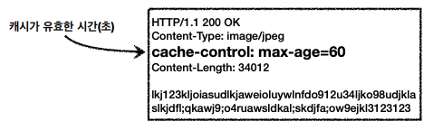

# 캐시 기본 동작

- 캐시가 없으면 같은 요청이더라도 동일한 헤더와 바디를 만들어서 전송
- 인터넷 네트워크는 느리고 비쌈

⇒ 느린 사용자 경험



- 최초 요청 시, 캐시와 관련된 헤더를 보냄
- 응답 결과를 캐시에 저장 (유요한 시간동안)


- 두번째 요청 시에는 캐시에서 찾아서 보여주기에 매우 빨라짐
- 세번째 요청에서 캐시 시간이 초과되면 다시 요청해야함
- 캐시 유효 시간이 초과하면 서버를 통해 데이터를 다시 조회하고 캐시를 갱신하는데, 이때 다시 네트워크 다운로드가 발생함

🧐 만약 캐시가 만료 되었는데, 클라이언트의 캐시와 서버의 데이터가 같다면 다시 다운 받을 필요가 있을까?

# 검증 헤더와 조건부 요청 - Last Modified

- 캐시 유효 시간이 초과해서 서버에 다시 요청하면 아래 두 상황 중 하나임
    1. 서버에서 기존 데이터를 변경함
    2. 서버에서 기존 데이터를 변경하지 않음

**⇒ 검증 헤더와 조건부 요청으로 해결함**

- 캐시 만료 후에도 서버에서 데이터를 변경하지 않았다면 클라이언트의 데이터와 서버의 데이터가 같다는 사실을 확인할 수 있는 방법이 필요함
- 데이터 최종 수정일을 헤더에서 관리함


- 수정이 안되면 http 응답을 만들 때, *304 Not Modified*로 보내고 HTTP Body가 없음

**⇒ 네트워크 부하가 줄어듦**


### 정리

- 캐시 유효 시간이 초과되어도 서버 데이터만 갱신되지 않았으면 ***304 Not Modified + 헤더 메타 정보***로만 응답 (바디X)
- 클라이언트는 서버가 보낸 응답 헤더 정보로 메타 정보를 갱신하고 캐시에 저장된 데이터 재활용
- 매우 실용적인 해결책

# 검증 헤더와 조건부 요청 - ETag

- 검증 헤더 : 캐시 데이터와 서버 데이터가 같은지 검증하는 데이터
- 조건부 요청 헤더 : 검증 헤어로 조건에 따른 분기
    - If-Modified-Since : Last-Modified
    - If-None-Match : ETag
    - 조건에 만족하면 200 OK, 아니면 304 Not Modified

### Last-Modified, If-Modified-Since 단점

- 1초 미만 단위로 캐시 조정 불가능
- 날짜 기반의 로직 사용
- 날짜는 다르지만 내용은 같은 경우
- 서버에서 별도로 캐시 로직을 관리하고 싶은 경우 불가 (ex. 주석 변경은 신경 안쓸거야)

### ETag(Entity Tag), If-None-Match


- 캐시용 데이터에 임의의 고유한 버전 이름을 달아둠
- 데이터가 변경되면 이름을 바꿔서 변경함 (Hash를 다시 생성)


- ETag만 확인해서 같으면 유지, 다르면 다시 받기

### 정리

- 캐시 제어 로직을 서버에서 완전히 관리
    - ETag를 언제 바꿀지!
- 클라이언트는 단순히 이 값을 서버에 제공

# 캐시와 조건부 요청 헤더

### Cache-Control 캐시 제어

- Cache-Control : max-age
    - 캐시 유효시간을 넣어줌, 초 단위
- Cache-Control : no-cache
    - 데이터는 캐시해도 되지만 항상 원(origin) 서버에 검증하고 사용
    - 원 서버 : 중간에 우리 눈에 보지 않는 캐시 프록시 서버는 제외한 서버
- Cache-Control : no-store
    - 데이터에 민감한 정보가 있으므로 저장하면 안됨
    - 보통 캐시하면 하드 디스크에 저장됨
    - 메모리에서 사용하고 최대한 빨리 삭제

### Pragma 캐시 제어 (하위 호환)

- Pragma : no-cache
- Http 1.0 하위 호환으로 보통 거의 사용하지 않음

### Expires 캐시 유효 기간 (하위 호환)

- 캐시 만료일을 정확한 날짜로 지정
- 초 단위가 훨씬 유연함 (Cache-Control: max-age 가 더 권장됨)
- Expires랑 Cache-Control이 같이 있으면 Expires가 무시됨

### 검증 헤더와 조건부 요청 헤더

- 검증 헤더 (Validator)
    - ETag
    - Last-Modified
- 조건부 요청 헤더
    - If-Match, If-None-Match : ETag 사용
    - If-Modified-Since, If-Unmodified-Since : Last-Modified 사용

# 프록시 캐시

### 원 서버에 직접 접근 vs 프록시 캐시 도입

**원 서버**


- 각각 다 기다려야해서 오래 걸림

**프록시 캐시**


- 중간 어딘가에 프록시를 둠
- CDN 서비스
- 첫번째 유저는 보통 느림

### 캐시 지시어 (directives)

- Cache-Control: public
  - 응답이 public에 저장되어도 됨
- Cache-Control: private
  - 응답이 해당 사용자만을 위한 것
  - private에 저장해야함
- Cache-Control: s-maxage
- Age: 60 (Http 헤더)
  - 오리진 서버에서 응답 후 프록시 캐니 내 머문 시간 (초 단위)

# 캐시 무효화

- 웹브라우저가 임의로 캐싱을 할 수 도 있음
- 확실한 캐시 무효화를 위해서는 아래 키워드들을 넣어야함

```
Cache-Control : no-cache, no-store, must-revalidate
Pragma: no-cache
```

- Cache-Control : no-cache
  - 항상 원서버에 검증
- Cache-Control : no-store
  - 저장하지 말고 최대한 빨리 삭제
- Cache-Control : must-revalidate
  - 캐시 만료 후 최초 조회 시 원 서버에 검증해야함
  - 원 서버 접근 실패 시 반드시 오류
- Pragma: no-cache
  - Http 1.0 하위 호환

구글은 max-age: 0까지 들어가있음 (요즘은 하위 호환이라 쓰지 말라고함)

### no-cache vs must-revalidate

- no-cache


- must-revalidate

